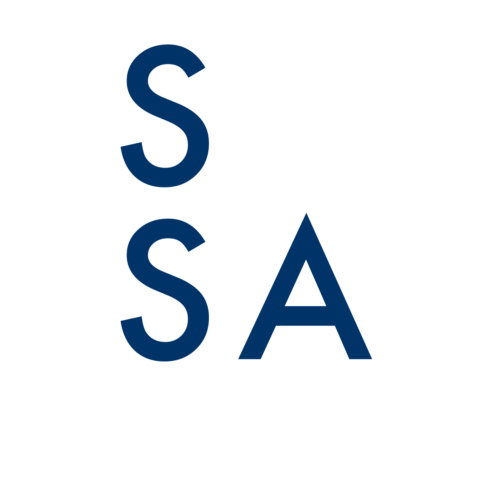
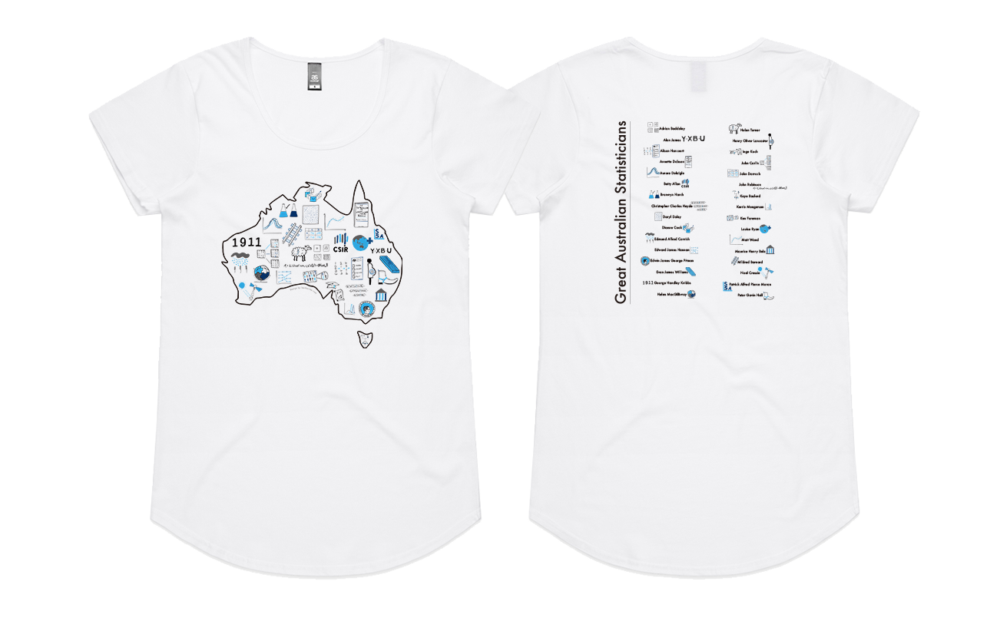
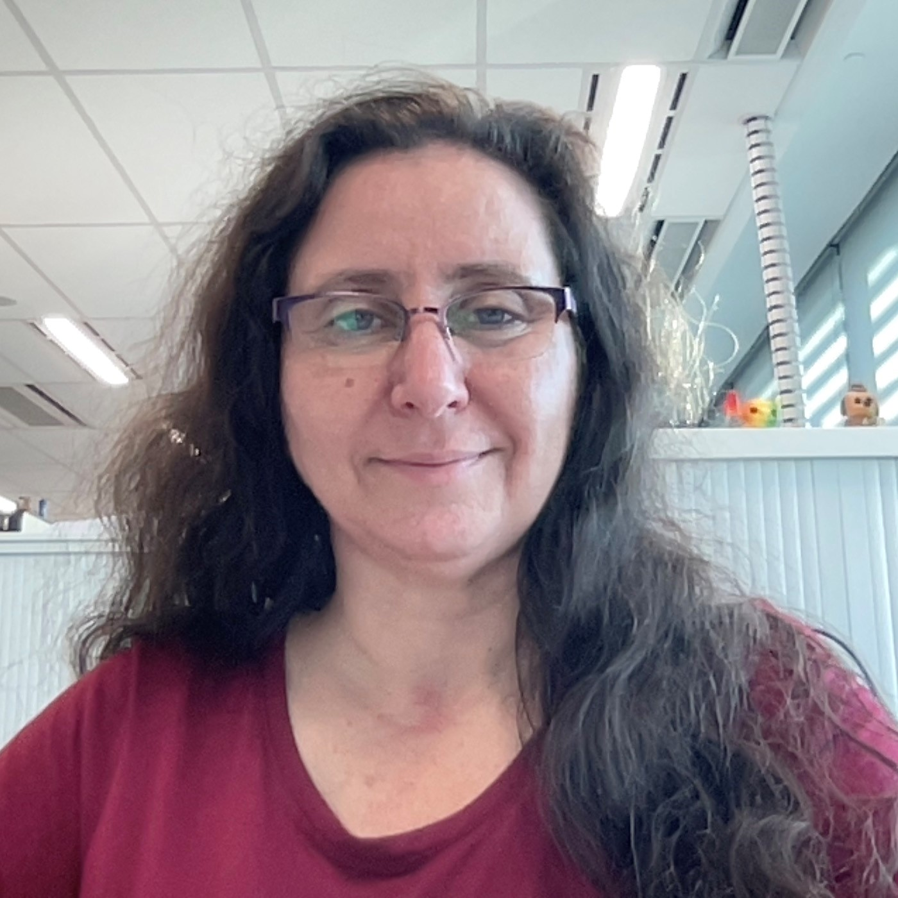
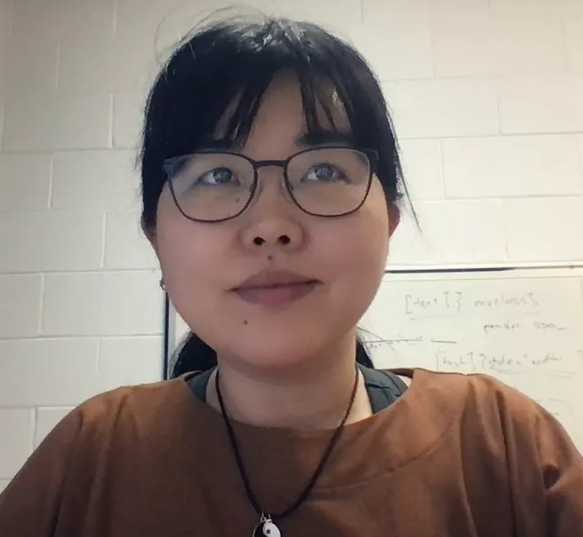
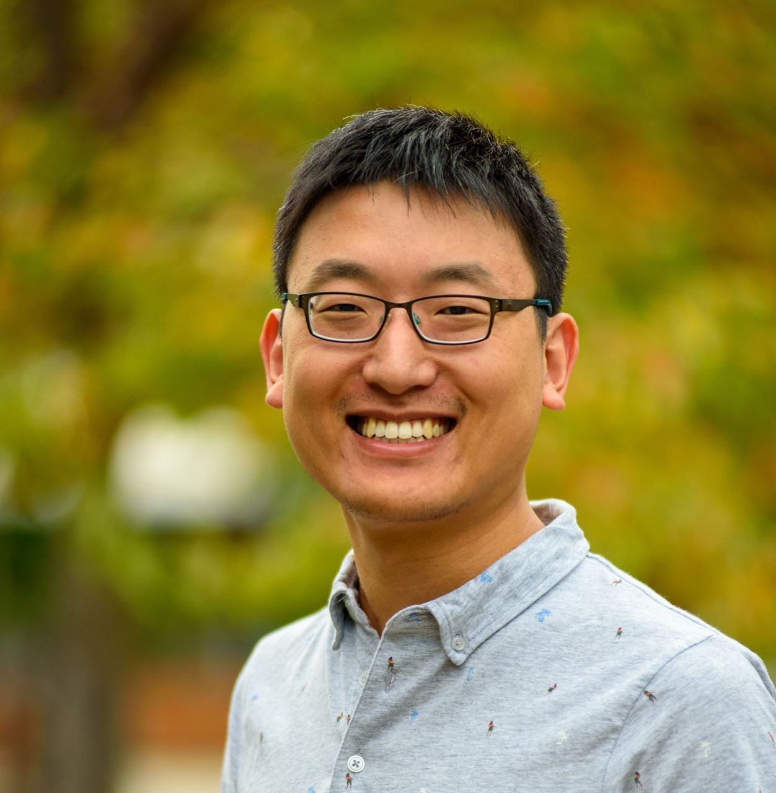
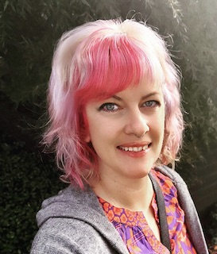
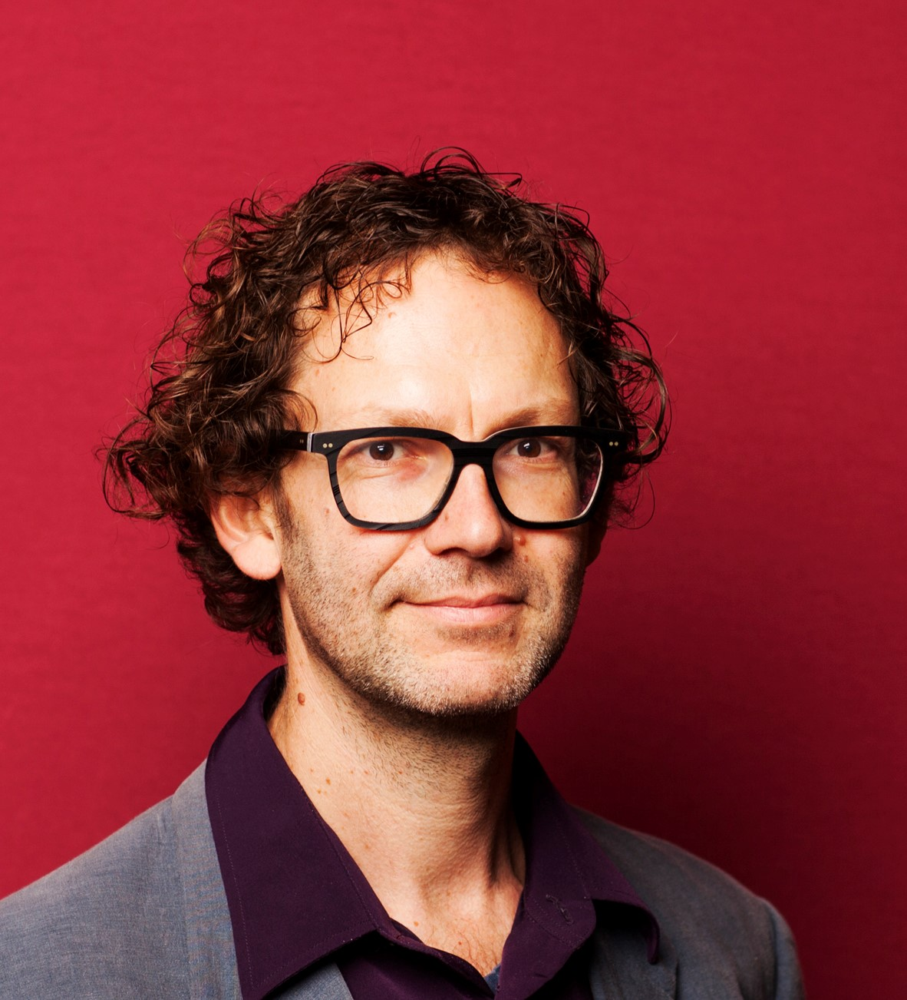

layout: true

```{r, include = FALSE}
current_file <- knitr::current_input()
basename <- gsub(".Rmd$", "", current_file)

knitr::opts_chunk$set(
  fig.path = sprintf("images/%s/", basename),
  fig.width = 6,
  fig.height = 4,
  fig.align = "center",
  fig.retina = 3,
  echo = FALSE,
  warning = FALSE,
  message = FALSE,
  cache = FALSE,
  cache.path = "cache/"
)
```


.footnote[
 These slides are available at https://statsocaus.github.io/vic/intro/`r basename`.html
]

```{r xaringan-themer, include=FALSE, warning=FALSE}
library(xaringanthemer)
style_duo_accent(primary_color = "#003469",
                 secondary_color = "#2babe2",
                 text_font_family = "Glacial Indifference",
                 header_font_family = "Glacial Indifference",
                 text_font_size = "30px"
                )
charcoal <- "#58595b"
```

```{css, echo = FALSE}
.speaker-photo {
  width: 150px;
  border: 3px solid black;
  border-radius: 5px;
}
```


---


class: inverse middle

# Welcome! 

---

# Acknowledgement of Country

<!-- https://www.statsoc.org.au/Guidelines  -->

<br><br>

.w-70[
We acknowledge that we are on the lands of the Wurundjeri peoples of the Kulin nation and who have been custodians of this land for thousands of years, and acknowledge and pay our respects to their Elders past and present.

<br>

We extend our welcome to also the traditional owners of the lands people in our livestream are joining from.

]


```{r}
person <- function(img, name, position = NULL, twitter = NULL, path = "council/") {
  position <- ifelse(is.null(position), "", 
                     paste0("**", position, "**"))
  twitter <- ifelse(is.null(twitter),
                    "",
                    paste0("<i class='fab fa-twitter'></i>", twitter))
  glue::glue(".person.f6[
                    .circle-image-120[
                    ]
                    {position}  
                    {name}  
                    {twitter}]")
}
```

---

name: council

# 👋 SSA Vic & Tas Council 2023


.flex[
.w-20[
`r person("ben.jpeg", "Ben Harrap", "President", "@BHarrap")`
]
.w-20[
`r person("emi.jpeg", "Emi Tanaka", "Vice-President", "@statsgen")`
]
.w-20[
`r person("elena.jpg", "Elena Tartaglia", "Secretary", twitter = "@elena_tartaglia")`
]
.w-20[
`r person("rick.jpg", "Rick Tankard", "Treasurer", twitter = "@RickTankard")`
]
.w-20[
`r person("dennis.png", "Dennis Leung", "Membership Officer")`
]
.w-20[
`r person("cameron.jpeg", "Cameron Patrick", "Communication Officer", twitter = "@camjpatrick")`
]


]

.flex[
.w-20[
`r person("melissa.jpg", "Melissa Middleton", "ECSS Rep", twitter = "@MK_Middleton")`
]
.w-20[
`r person("alun.jpg", "Alun Pope", "Deputy Secretary")`
]
.w-20[
`r person("anna.jpg", "Anna Wilkinson", "Deputy Treasurer", twitter = "@AnnaLWil")`
]
.w-20[
`r person("ben-wee.jpg", "Benjamin Wee", "Deputy Membership Officer", twitter = "@BenwWee")`
]
.w-20[
`r person("patrick.jpeg", "Patrick Robotham", "Industry Rep", twitter = "@PatrickRobotham")`
]
.w-20[
`r person("swen.jpg", "Swen Kuh", "Membership Officer", twitter = "@swenkuh")`
]
]


---

name: contact

#  Statistical Society of Australia <br> .f2.color-secondary[Victorian & Tasmanian Branch]

.fr.center[
The Great Australian <br>Statisticians T-Shirt



.f4[[Designed by Ben Harrap](https://benharrap.com/post/2020-12-02-tshirt-competition/)]

<i class="fas fa-shopping-cart"></i> .f4[Buy at https://www.statsoc.org.au/SSA-T-Shirt]

.f6[Proceeds used to support early career statisticians.]
]

.lh-title[
<br>
<i class="fa fa-link color-secondary"></i>  [www.statsoc.org.au/Victoria](https://www.statsoc.org.au/Victoria)
<br>
<i class="fa fa-envelope color-secondary"></i> [vic.branch@statsoc.org.au](mailto:vic.branch@statsoc.org.au) <br><i class="fa fa-envelope color-primary"></i> [eo@statsoc.org.au](mailto:eo@statsoc.org.au)  

<br><Br>
<i class="fab fa-twitter color-secondary animated bounce"></i> [@SSAVictoria](https://twitter.com/SsaVictoria) &nbsp;&nbsp;&nbsp; <i class="fab fa-twitter color-primary"></i> [@StatSocAus](https://twitter.com/StatSocAus)  
  <br>
<i class="fab fa-meetup color-secondary"></i> [bit.ly/ssavic-meetup](http://bit.ly/ssavic-meetup)  
]

???

* You can find how to get in touch here, 
* in particular, if you want to get in touch with the Victorian & Tasmanian Branch, please get in touch using the Victorian email address
* I also want to remind you that the Society now has a T-shirt, and you can buy this in the link give here with the proceeds going to support early career statisticians


---

# Upcoming events


- <i class="fas fa-calendar"></i> **July Event** <br><br>*Sam Brilleman, SEEK* <br><br>
<br>

- <i class="fas fa-calendar"></i> **Date TBC** <br><br> *Machine Learning with Python*


---

# Funding and Membership


* **ASC2023 funding scheme closing soon!**
  * Open to Early Career and Student members
  * Covers registration for ASC and/or OZCOTS
  * For more info or to apply: [bit.ly/3P6ijne](bit.ly/3P6ijne)

<br>

* **Join SSA Vic & Tas!**:
  * SSA membership is $20 only for students 
  * Full membership is $250 or $240 for automatic renewal
  * [Recent graduates are eligible for discounts](https://statsoc.org.au/Forum-general-topics/12893603)!
  * Benefits: https://www.statsoc.org.au/page-1075427

---

#  🥇 Di Cook Award

brought to you by the _SSA Victorian and Tasmanian Branch_

* This is an **open-source statistical software award** open to students of Victorian and Tasmanian institutes. 

<br>

.flex[
.w-20[

]
.w-60.bg-color-primary.pa3[
https://statsocaus.github.io/dicook-award/
]
]


---

class: center middle

# <i class="fab fa-slack"></i> SSA Community Slack


.f1[[bit.ly/ssa-slack](https://bit.ly/ssa-slack)]

---

class: inverse


# 👋 Meet our Mentors

.right-column[
.circle-image-200.fl[
]

.circle-image-200.fl[
]

.circle-image-200.fl[
]

.circle-image-200.fl[
]


.circle-image-200.fl[
]

.circle-image-200.fl[
]

.circle-image-200.fl[
]

.circle-image-200.fl[
]
]

.left-column[
<br>
**Alun Pope** <br>
**Anna Hepworth** <br>
**Bas Latcham** <br>
**Emi Tanaka** <br>
**Koleth Chia** <br>
**Lidija Turkovic** <br>
**Nat Kelly** <br>
**Russell Thomson** <br>
]


???

---

class: inverse


# Schedule of Event

Short talks 
  * 5 of our mentors will provide some insight to their careers <br><br>
  
Speed mentoring rounds
  * 5 Rounds of 10min 'speed mentoring' sessions in pre-allocated groups <br><br>

Free-range mentoring round
  * Your chance to speak with a mentor of your choice <br><br>

