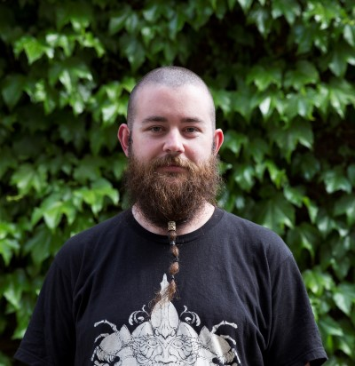

layout: true

```{r, include = FALSE}
current_file <- knitr::current_input()
basename <- gsub(".Rmd$", "", current_file)

knitr::opts_chunk$set(
  fig.path = sprintf("images/%s/", basename),
  fig.width = 6,
  fig.height = 4,
  fig.align = "center",
  fig.retina = 3,
  echo = FALSE,
  warning = FALSE,
  message = FALSE,
  cache = FALSE,
  cache.path = "cache/"
)
```


.footnote[
 These slides are available at https://statsocaus.github.io/vic/intro/`r basename`.html
]

```{r xaringan-themer, include=FALSE, warning=FALSE}
library(xaringanthemer)
style_duo_accent(primary_color = "#003469",
                 secondary_color = "#2babe2",
                 text_font_family = "Glacial Indifference",
                 header_font_family = "Glacial Indifference",
                 text_font_size = "30px"
                )
charcoal <- "#58595b"
```

---


class: inverse middle

# Welcome! {{content}}

???


# Acknowledgement of Country

<!-- https://www.statsoc.org.au/Guidelines  -->

.measure.lh-title[
In the spirit of reconciliation the Statistical Society of Australia acknowledges the Traditional Custodians of country throughout Australia and their connections to land, sea and community. We pay our respect to their elders past and present and extend that respect to all Aboriginal and Torres Strait Islander peoples today.
]


---

name: council

# SSA Vic Council 2021

```{r}
person <- function(img, name, position = NULL) {
  position <- ifelse(is.null(position), "", 
                     paste0("**", position, "**"))
  glue::glue(".person.f4[
                    .circle-image-120[
                    ]
                    {position}  
                    {name}]")
}
```

.flex[
`r person("emi.jpeg", "Emi Tanaka", "President")`
`r person("damjan.jpeg", "Damjan Vukcevic", "Vice-President")`
`r person("ben.jpeg", "Ben Harrap")`
`r person("cameron.jpeg", "Cameron Patrick")`
`r person("daniel.jpeg", "Daniel Fryer")`
`r person("lizzie.jpeg", "Elizabeth Korevaar")`

]
<br>
.flex[
`r person("hien.jpeg", "Hien Nguyen")`
`r person("kevin.jpeg", "Kevin Wang")`
`r person("lauren.jpg", "Lauren Kennedy")`
`r person("lidija.jpeg", "Lidija Turkovic")`
`r person("patrick.jpeg", "Patrick Robotham")`
`r person("rheanna.jpg", "Rheanna Mainzer")`
]

---

name: contact

#  Statistical Society of Australia .f2.color-secondary[Victorian Branch]

.f4.lh-title.measure[
**The purpose of SSA Vic is to advance the study and practice of statistics.** ]

.lh-title[
<br>
<i class="fa fa-link color-secondary"></i>  [www.statsoc.org.au/Victoria](https://www.statsoc.org.au/Victoria)  
<br>
<i class="fa fa-envelope color-secondary"></i> [vic.branch@statsoc.org.au](mailto:vic.branch@statsoc.org.au) &nbsp;&nbsp;&nbsp;<i class="fa fa-envelope color-primary"></i> [eo@statsoc.org.au](mailto:eo@statsoc.org.au)  
<br>
<i class="fab fa-twitter color-secondary animated bounce"></i> [@SSAVictoria](https://twitter.com/SsaVictoria) &nbsp;&nbsp;&nbsp; <i class="fab fa-twitter color-primary"></i> [@StatSocAus](https://twitter.com/StatSocAus)  
  <br>
<i class="fab fa-meetup color-secondary"></i> [bit.ly/ssavic-meetup](http://bit.ly/ssavic-meetup)  
]


---

name: benefits

# SSA Membership Benefits


* Huge discounts in workshops!<br> .f5[<i class="fas fa-comment"></i> Let the SSA CPD Committee know what workshop you want [here](https://docs.google.com/forms/d/e/1FAIpQLSdvGKKG1mZ7nG7uxeMam0LqBoUEmyFyYOiLfqnNUcBh5Ol3Iw/viewform).]
<details class="f5"><summary>Workshops run in 2020</summary>
<ul>
<li>Machine Learning with Python (SSA Vic)</li>
<li>Introduction to Julia for Statistics and Data Science (SSA Vic)</li>
<li>Data Visualisation with R (SSA Vic)</li>
<li>Data Wrangling with R (SSA NSW)</li>
<li>Semiparametric regression with R (SSA NSW)</li>
<li>Version control using Git and RStudio (SSA)</li>
</ul>
</details>
--

* Member-only events!<br>
  .f5[<i class="fas fa-users"></i> Full list of events: https://www.statsoc.org.au/Events-listing]
--

* [Fellowship funding support](https://www.statsoc.org.au/Fellowship-support), [PhD or Masters top-up scholarships](https://statsoc.org.au/top_ups), ...
--

* And more!
  - https://www.statsoc.org.au/Membership-benefits
  - Student membership is only $20 per year.
--


.ba.pa2.w-70.border-color-black.bw2.bg-color-primary.white[.animated.flash[<i class="fas fa-caret-right"></i>] To join go to: https://www.statsoc.org.au/How-to-join
]

---

# Save the date!

* **Tue 18th May**<br> <i class="fas fa-trophy"></i> Trivia (there may be prizes)

--
  

* From May onwards, we may start switching to hybrid (in-person + online).  

--

*Stay tuned for more details!*

---

class: inverse middle


# The statistical quandaries of an ecologist<br> .f2[Applied and theoretical statistics for conservation]
.circle-image-200.fr[
]

## Prof. Kerrie Mengersen (Director of QUT Centre for Data Science),
## Prof. Eric Stone (Director of ANU Biological Data Science Institute), and 
## Prof. Joanna Batstone (Director of Monash Data Futures Institute).

Thanks to 
- **Francis Hui** (Canberra Event Coordinator)

???


