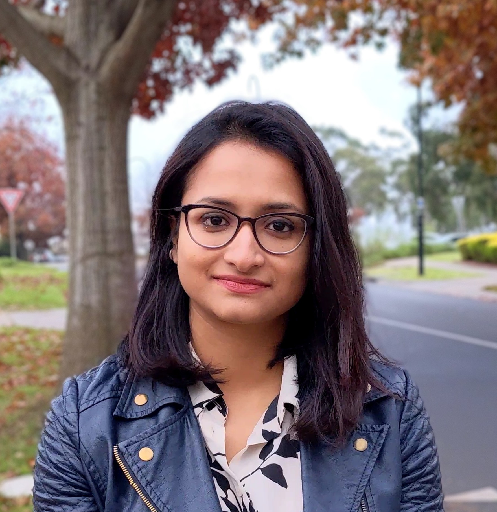

layout: true

```{r, include = FALSE}
current_file <- knitr::current_input()
basename <- gsub(".Rmd$", "", current_file)

knitr::opts_chunk$set(
  fig.path = sprintf("images/%s/", basename),
  fig.width = 6,
  fig.height = 4,
  fig.align = "center",
  fig.retina = 3,
  echo = FALSE,
  warning = FALSE,
  message = FALSE,
  cache = FALSE,
  cache.path = "cache/"
)
```


.footnote[
 These slides are available at https://statsocaus.github.io/vic/intro/`r basename`.html
]

```{r xaringan-themer, include=FALSE, warning=FALSE}
library(xaringanthemer)
style_duo_accent(primary_color = "#003469",
                 secondary_color = "#2babe2",
                 text_font_family = "Glacial Indifference",
                 header_font_family = "Glacial Indifference",
                 text_font_size = "30px"
                )
charcoal <- "#58595b"
```

---


class: inverse middle

# Welcome! {{content}}

???


# Acknowledgement of Country

<!-- https://www.statsoc.org.au/Guidelines  -->

.measure.lh-title[
In the spirit of reconciliation the Statistical Society of Australia acknowledges the Traditional Custodians of country throughout Australia and their connections to land, sea and community. We pay our respect to their elders past and present and extend that respect to all Aboriginal and Torres Strait Islander peoples today.
]


---

name: council

# SSA Vic Council 2022

```{r}
person <- function(img, name, position = NULL, twitter = NULL) {
  position <- ifelse(is.null(position), "", 
                     paste0("**", position, "**"))
  twitter <- ifelse(is.null(twitter),
                    "",
                    paste0("<i class='fab fa-twitter'></i>", twitter))
  glue::glue(".person.f5[
                    .circle-image-100[
                    ]
                    {position}  
                    {name}  
                    {twitter}]")
}
```


.flex[
`r person("emi.jpeg", "Emi Tanaka", "President", "@statsgen")`
`r person("ben.jpeg", "Ben Harrap", "Vice-President", "@BHarrap")`
`r person("elena.jpg", "Elena Tartaglia", "Secretary", twitter = "@elena_tartaglia")`
`r person("rick.jpg", "Rick Tankard", "Treasurer", twitter = "@RickTankard")`
`r person("cameron.jpeg", "Cameron Patrick", "Communication Officer", twitter = "@camjpatrick")`
`r person("dennis.png", "Dennis Leung", "Membership Officer")`


]
<br>
.flex[
`r person("melissa.jpg", "Melissa Middleton", "ECSS Rep", twitter = "@MK_Middleton")`
`r person("patrick.jpeg", "Patrick Robotham", "Industry Rep", twitter = "@PatrickRobotham")`
`r person("joanne.jpg", "Joanne Potts", "Deputy Secretary", twitter = "@AnalyticalEdge")`
`r person("lizzie.jpeg", "Elizabeth Korevaar", "Deputy Treasurer", twitter = "@lizziekorevaar")`
`r person("belinda.jpg", "Belinda Maher", "Deputy Communication Officer", twitter = "@mingabelle")`
`r person("swen.jpg", "Swen Kuh", "Deputy Membership Officer", twitter = "@swenkuh")`


]


---


#  Statistical Society of Australia <br> .f2.color-secondary[Victorian Branch]

.fr.center[
The Great Australian <br>Statisticians T-Shirt


.f4[[Designed by Ben Harrap](https://benharrap.com/post/2020-12-02-tshirt-competition/)]

<i class="fas fa-shopping-cart"></i> Buy at http://bit.ly/ssa-tshirt

.f6[Proceeds used to support early career statisticians.]
]

.lh-title[
<br>
<i class="fa fa-link color-secondary"></i>  [www.statsoc.org.au/Victoria](https://www.statsoc.org.au/Victoria)
<br>
<i class="fa fa-envelope color-secondary"></i> [vic.branch@statsoc.org.au](mailto:vic.branch@statsoc.org.au) <br><i class="fa fa-envelope color-primary"></i> [eo@statsoc.org.au](mailto:eo@statsoc.org.au)  

<br><Br>
<i class="fab fa-twitter color-secondary animated bounce"></i> [@SSAVictoria](https://twitter.com/SsaVictoria) &nbsp;&nbsp;&nbsp; <i class="fab fa-twitter color-primary"></i> [@StatSocAus](https://twitter.com/StatSocAus)  
  <br>
<i class="fab fa-meetup color-secondary"></i> [bit.ly/ssavic-meetup](http://bit.ly/ssavic-meetup)  
]


---

name: benefits

# SSA Membership Benefits


* Huge discounts in workshops!<br> .f5[<i class="fas fa-comment"></i> Let the SSA CPD Committee know what workshop you want [here](https://docs.google.com/forms/d/e/1FAIpQLSdvGKKG1mZ7nG7uxeMam0LqBoUEmyFyYOiLfqnNUcBh5Ol3Iw/viewform).]
<details class="f5"><summary>Workshops run in 2020</summary>
<ul>
<li>Machine Learning with Python (SSA Vic)</li>
<li>Introduction to Julia for Statistics and Data Science (SSA Vic)</li>
<li>Data Visualisation with R (SSA Vic)</li>
<li>Data Wrangling with R (SSA NSW)</li>
<li>Semiparametric regression with R (SSA NSW)</li>
<li>Version control using Git and RStudio (SSA)</li>
</ul>
</details>
--

* Member-only events!<br>
  .f5[<i class="fas fa-users"></i> Full list of events: https://www.statsoc.org.au/Events-listing]
--

* [Fellowship funding support](https://www.statsoc.org.au/Fellowship-support), [PhD or Masters top-up scholarships](https://statsoc.org.au/top_ups), ...
--

* And more!
  - https://www.statsoc.org.au/Membership-benefits
  - Student membership is only $20 per year.
--


.ba.pa2.w-70.border-color-black.bw2.bg-color-primary.white[.animated.flash[<i class="fas fa-caret-right"></i>] To join go to: https://www.statsoc.org.au/How-to-join
]


---

class: inverse middle


# Di Cook Award Presentations

.fl[
.circle-image-120[
 ]  Patrick Weihao Li


]

.fr.pl2[


.circle-image-120[
]  Jeffrey Pullin

.circle-image-120[
]  Sayani Gupta
]


<br>
<br>
<br>
<br>
<br>
<br>

Thanks to 
- **Dennis Leung** (Event Coordinator)

???


