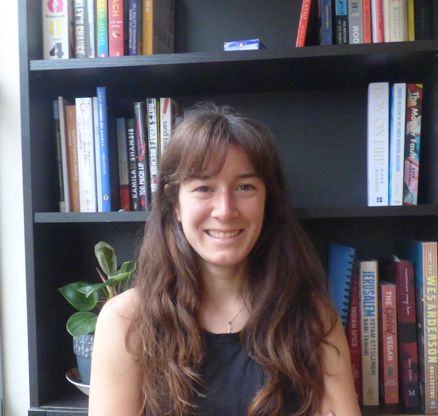
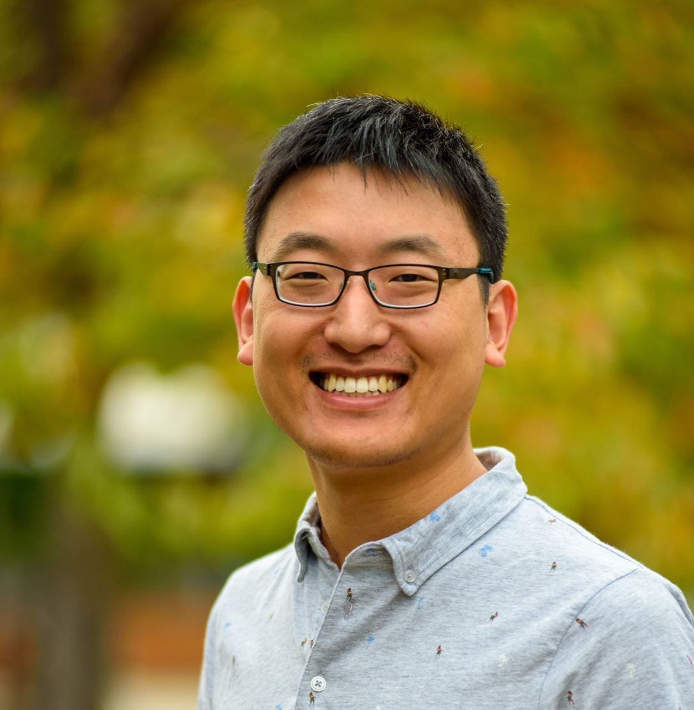
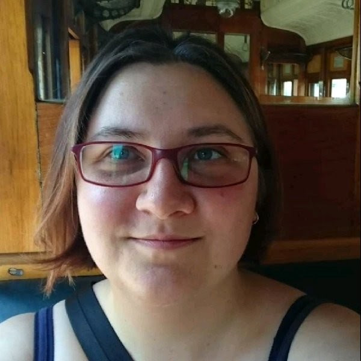
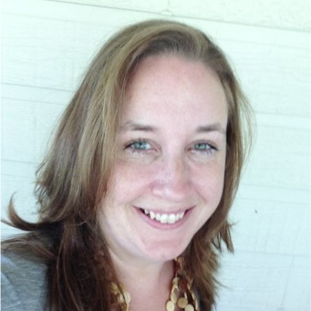

layout: true

```{r, include = FALSE}
current_file <- knitr::current_input()
basename <- gsub(".Rmd$", "", current_file)

knitr::opts_chunk$set(
  fig.path = sprintf("images/%s/", basename),
  fig.width = 6,
  fig.height = 4,
  fig.align = "center",
  fig.retina = 3,
  echo = FALSE,
  warning = FALSE,
  message = FALSE,
  cache = FALSE,
  cache.path = "cache/"
)
```


.footnote[
 These slides are available at https://statsocaus.github.io/vic/intro/`r basename`.html
]

```{r xaringan-themer, include=FALSE, warning=FALSE}
library(xaringanthemer)
style_duo_accent(primary_color = "#003469",
                 secondary_color = "#2babe2",
                 text_font_family = "Glacial Indifference",
                 header_font_family = "Glacial Indifference",
                 text_font_size = "30px"
                )
charcoal <- "#58595b"
```

---


class: inverse middle

# Welcome! {{content}}

???


# Acknowledgement of Country

<!-- https://www.statsoc.org.au/Guidelines  -->

.measure.lh-title[
In the spirit of reconciliation the Statistical Society of Australia acknowledges the Traditional Custodians of country throughout Australia and their connections to land, sea and community. We pay our respect to their elders past and present and extend that respect to all Aboriginal and Torres Strait Islander peoples today.
]


---

name: council

# SSA Vic Council 2021

```{r}
person <- function(img, name, position = NULL) {
  position <- ifelse(is.null(position), "", 
                     paste0("**", position, "**"))
  glue::glue(".person.f5[
                    .circle-image-120[
                    ]
                    {position}  
                    {name}]")
}
```

.flex[
`r person("emi.jpeg", "Emi Tanaka", "President")`
`r person("damjan.jpeg", "Damjan Vukcevic", "Vice-President")`
`r person("ben.jpeg", "Ben Harrap", "Secretary")`
`r person("lizzie.jpeg", "Elizabeth Korevaar", "Treasurer")`
`r person("kevin.jpeg", "Kevin Wang", "Communication Officer")`
`r person("rheanna.jpg", "Rheanna Mainzer", "Membership Officer")`
]
<br>
.flex[
`r person("cameron.jpeg", "Cameron Patrick", "ECSS Rep")`
`r person("patrick.jpeg", "Patrick Robotham", "Industry Rep")`
`r person("lidija.jpeg", "Lidija Turkovic", "Deputy Secretary")`
`r person("hien.jpeg", "Hien Nguyen", "Deputy Treasurer")`
`r person("daniel.jpeg", "Daniel Fryer", "Deputy Communication Officer")`
`r person("lauren.jpg", "Lauren Kennedy", "Deputy Membership Officer")`

]

---

name: contact

#  Statistical Society of Australia <br> .f2.color-secondary[Victorian Branch]

.fr.center[
The Great Australian <br>Statisticians T-Shirt


.f4[[Designed by Ben Harrap](https://benharrap.com/post/2020-12-02-tshirt-competition/)]

<i class="fas fa-shopping-cart"></i> Buy at http://bit.ly/ssa-tshirt

.f6[Proceeds used to support early career statisticians.]
]

.lh-title[
<br>
<i class="fa fa-link color-secondary"></i>  [www.statsoc.org.au/Victoria](https://www.statsoc.org.au/Victoria)
<br>
<i class="fa fa-envelope color-secondary"></i> [vic.branch@statsoc.org.au](mailto:vic.branch@statsoc.org.au) <br><i class="fa fa-envelope color-primary"></i> [eo@statsoc.org.au](mailto:eo@statsoc.org.au)  

<br><Br>
<i class="fab fa-twitter color-secondary animated bounce"></i> [@SSAVictoria](https://twitter.com/SsaVictoria) &nbsp;&nbsp;&nbsp; <i class="fab fa-twitter color-primary"></i> [@StatSocAus](https://twitter.com/StatSocAus)  
  <br>
<i class="fab fa-meetup color-secondary"></i> [bit.ly/ssavic-meetup](http://bit.ly/ssavic-meetup)  
]

---

# SSA Vic Conference & Workshop Funding

* **Exclusive to SSA Vic members!**
* Funding of up to $250 to cover attendance at a conference or a workshop
* To apply for funding, complete the form [here <i class="fas fa-file"></i>](https://forms.gle/oba1V6iZA7DdsjYf9) 
--

* Congratulations to those who are already funded in 2021!

<br>

.flex[
.w-20.f5[
```{r, echo = FALSE, message = FALSE, warning = FALSE}
library(tidyverse)
winners <- read_csv(file = "images/funding-2021-08/funded.txt") %>% pull(funded) %>% 
  sort()
nsplit <- ceiling(length(winners)/2)
```
```{css, echo = FALSE}
.funded-photo {
  height: 100px;
  border: 2px solid black;
}
```

```{r, results = "asis"}
cat(glue::glue("- {winners[1:nsplit]}"), sep = "\n")
```
]
.w-20.f5[
```{r, results = "asis"}
cat(glue::glue("- {winners[(nsplit + 1):length(winners)]}"), sep = "\n")
```
]
.w-60[
.flex[
```{r, results = "asis", echo = FALSE}
photos <- dir("images/funding-2021-08/", pattern = ".+[.](jpg|JPG|jpeg)") 
cat(glue::glue(" "))
```
]
]
]


---

class: inverse 

# Meet our industry experts

.flex.f4[
.w-33.center[
.pb2[
<br>
**Anna Quaglieri**   
.f5[Bioinformatics Data Scientist at Mass Dynamics]]
<br>
**Stephen Bush**    
.f5[Principal Optimisation Analyst at SEEK]
]
.w-33.center[
.pb2[
<br>
**Kohleth Chia**  
.f5[Data Scientist Lead at Bunnings]  ]
<br>
**Belinda Maher**  
.f5[Senior Public Transport Planner]  
]
.w-33.center[
.pb2[
<br>
**Steph Stammel**  
.f5[Principal Econometrician ]
<br>
]
<br>
**Denzel Florez**   
.f5[Senior Analyst at Macquarie Group]
]]
.f4.pt4[
Thanks to **Cameron Patrick** and **Kevin Wang** for coordinating the event!

]


