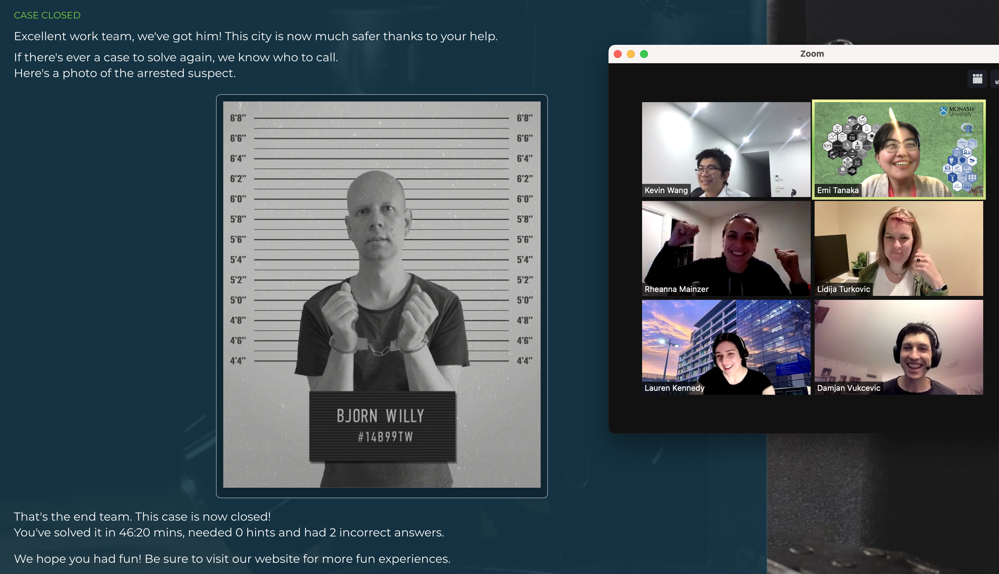
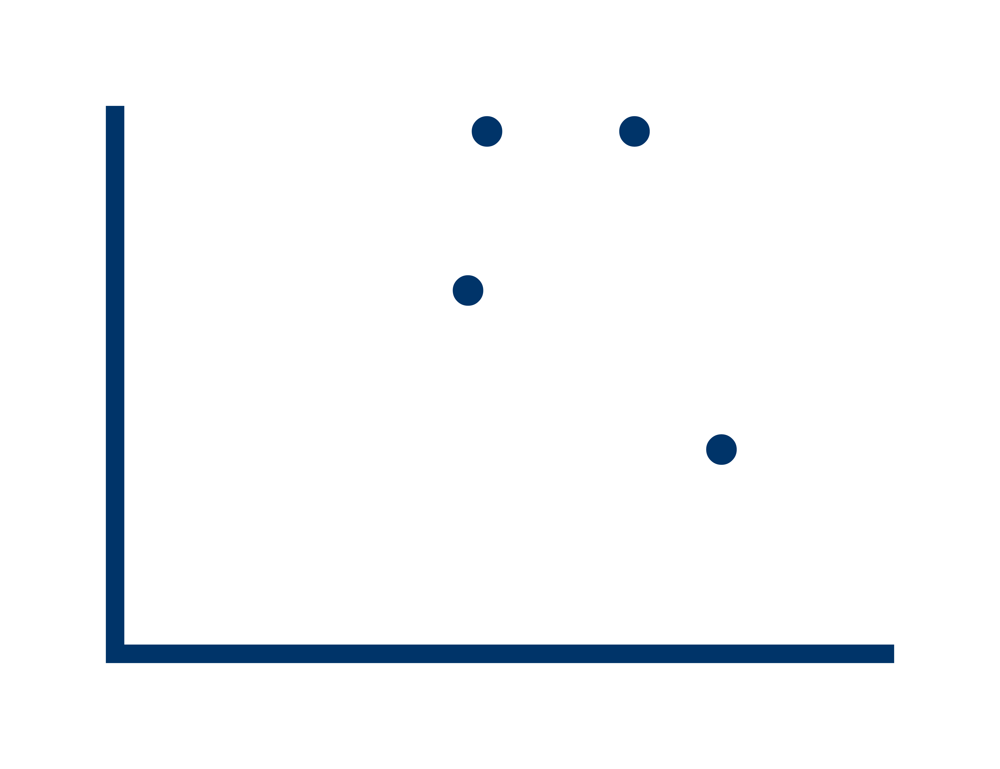

layout: true

```{r, include = FALSE}
current_file <- knitr::current_input()
basename <- gsub(".Rmd$", "", current_file)

knitr::opts_chunk$set(
  fig.path = sprintf("images/%s/", basename),
  fig.width = 6,
  fig.height = 4,
  fig.align = "center",
  fig.retina = 3,
  echo = FALSE,
  warning = FALSE,
  message = FALSE,
  cache = FALSE,
  cache.path = "cache/"
)
```


.footnote[
 These slides are available at https://statsocaus.github.io/vic/intro/`r basename`.html
]

```{r xaringan-themer, include=FALSE, warning=FALSE}
library(xaringanthemer)
style_duo_accent(primary_color = "#003469",
                 secondary_color = "#2babe2",
                 text_font_family = "Glacial Indifference",
                 header_font_family = "Glacial Indifference",
                 text_font_size = "30px"
                )
charcoal <- "#58595b"
```

---


class: inverse middle

# Welcome! {{content}}

???


# Acknowledgement of Country

<!-- https://www.statsoc.org.au/Guidelines  -->

.measure.lh-title[
In the spirit of reconciliation the Statistical Society of Australia acknowledges the Traditional Custodians of country throughout Australia and their connections to land, sea and community. We pay our respect to their elders past and present and extend that respect to all Aboriginal and Torres Strait Islander peoples today.
]


---

name: council

# SSA Vic Council 2021

```{r}
person <- function(img, name, position = NULL) {
  position <- ifelse(is.null(position), "", 
                     paste0("**", position, "**"))
  glue::glue(".person.f5[
                    .circle-image-120[
                    ]
                    {position}  
                    {name}]")
}
```

.flex[
`r person("emi.jpeg", "Emi Tanaka", "President")`
`r person("damjan.jpeg", "Damjan Vukcevic", "Vice-President")`
`r person("ben.jpeg", "Ben Harrap", "Secretary")`
`r person("lizzie.jpeg", "Elizabeth Korevaar", "Treasurer")`
`r person("kevin.jpeg", "Kevin Wang", "Communication Officer")`
`r person("rheanna.jpg", "Rheanna Mainzer", "Membership Officer")`
]
<br>
.flex[
`r person("cameron.jpeg", "Cameron Patrick", "ECSS Rep")`
`r person("patrick.jpeg", "Patrick Robotham", "Industry Rep")`
`r person("lidija.jpeg", "Lidija Turkovic", "Deputy Secretary")`
`r person("hien.jpeg", "Hien Nguyen", "Deputy Treasurer")`
`r person("daniel.jpeg", "Daniel Fryer", "Deputy Communication Officer")`
`r person("lauren.jpg", "Lauren Kennedy", "Deputy Membership Officer")`

]

.center.animated.pulse.infinite.slow[
**We are seeking expressions of interest for  joining the council in 2022!**

]


---

name: contact

#  Statistical Society of Australia <br> .f2.color-secondary[Victorian Branch]

.fr.center[
The Great Australian <br>Statisticians T-Shirt


.f4[[Designed by Ben Harrap](https://benharrap.com/post/2020-12-02-tshirt-competition/)]

<i class="fas fa-shopping-cart"></i> .f4[Buy at https://www.statsoc.org.au/SSA-T-Shirt]

.f6[Proceeds used to support early career statisticians.]
]

.lh-title[
<br>
<i class="fa fa-link color-secondary"></i>  [www.statsoc.org.au/Victoria](https://www.statsoc.org.au/Victoria)
<br>
<i class="fa fa-envelope color-secondary"></i> [vic.branch@statsoc.org.au](mailto:vic.branch@statsoc.org.au) <br><i class="fa fa-envelope color-primary"></i> [eo@statsoc.org.au](mailto:eo@statsoc.org.au)  

<br><Br>
<i class="fab fa-twitter color-secondary animated bounce"></i> [@SSAVictoria](https://twitter.com/SsaVictoria) &nbsp;&nbsp;&nbsp; <i class="fab fa-twitter color-primary"></i> [@StatSocAus](https://twitter.com/StatSocAus)  
  <br>
<i class="fab fa-meetup color-secondary"></i> [bit.ly/ssavic-meetup](http://bit.ly/ssavic-meetup)  
]

---

# SSA Vic Conference & Workshop Funding

* **Exclusive to SSA Vic members!**
* Funding of up to $250 to cover attendance at a conference or a workshop
* To apply for funding, complete the form [here <i class="fas fa-file"></i>](https://forms.gle/oba1V6iZA7DdsjYf9) 
* You can find some workshops listed at [SSA website events listing](https://www.statsoc.org.au/Events-listing) <br>which currently includes:
  * [Machine learning with Python](https://www.statsoc.org.au/Events-listing) .f5[13-14 Nov 2021]
  * [An Introduction to Bayesian Modelling Using Greta](https://www.statsoc.org.au/event-4472476) .f5[16-17 Nov 2021 (SOLD OUT)] 
  * [Introduction to SQL, crash course](https://www.statsoc.org.au/event-4525684) .f5[18-19 Nov 2021]
  * [Data Visualisation with R](https://www.statsoc.org.au/event-4476797) .f5[6 Dec 2021]
  * Advanced Data Visualisation with R .f5[coming soon]
  * Stan workshop .f5[coming soon]

---

# Di Cook Award


<br>

* Calling for submission for your statistical software product!
* Open only to students (or recent graduates) of Victorian or Tasmanian institutes
* Submissions close at **Fri 26th Nov 2021**
* Winner, announced in March 2022, will win $1,000
* Find more information at

<br>

.flex[
.w-20[

]
.w-60.bg-color-primary.pa3[
https://statsocaus.github.io/dicook-award/
]
]


---

# Social event post-lecture

* Come join for some **virtual escape room challenge** after the lecture (optional)
* OR join in for some **social chat**

**Register at https://www.statsoc.org.au/event-4520034** <br>


<center>

</center>


---

class: inverse middle


# Tales of clinical trials, tribulations, twists and turns

.fr.pr3[
.circle-image-200[
]
]

Professor **Andrew Forbes**  
Monash University

 .f4.white[Victoria Branch]

Tue 12th Oct 2021 6PM AEST

<i class="fas fa-comments"></i> Followed by social event from 7PM AEST


---
<br>

Thanks to 
- **Rheanna Mainzer** (Event Coordinator)
