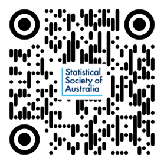
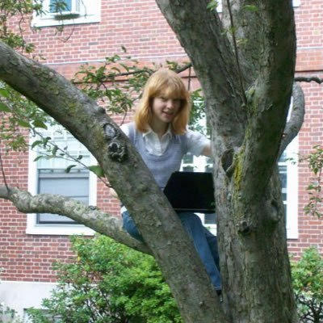

layout: true

```{r, include = FALSE}
current_file <- knitr::current_input()
basename <- gsub(".Rmd$", "", current_file)

knitr::opts_chunk$set(
  fig.path = sprintf("images/%s/", basename),
  fig.width = 6,
  fig.height = 4,
  fig.align = "center",
  fig.retina = 3,
  echo = FALSE,
  warning = FALSE,
  message = FALSE,
  cache = FALSE,
  cache.path = "cache/"
)
```


.footnote[
 These slides are available at https://statsocaus.github.io/vic/intro/`r basename`.html
]

```{r xaringan-themer, include=FALSE, warning=FALSE}
library(xaringanthemer)
style_duo_accent(primary_color = "#003469",
                 secondary_color = "#2babe2",
                 text_font_family = "Glacial Indifference",
                 header_font_family = "Glacial Indifference",
                 text_font_size = "30px"
                )
charcoal <- "#58595b"
```


---


class: inverse middle

# Welcome! 

???


# Acknowledgement of Country

<!-- https://www.statsoc.org.au/Guidelines  -->

Before we begin, we would like to acknowledge the Traditional Custodians of country throughout Australia and their connections to land, sea and community. We pay our respect to their elders past and present and extend that respect to all Aboriginal and Torres Strait Islander peoples today.


---

name: council

# SSA Vic Council 2021

```{r}
person <- function(img, name, position = NULL) {
  position <- ifelse(is.null(position), "", 
                     paste0("**", position, "**"))
  glue::glue(".person.f5[
                    .circle-image-120[
                    ]
                    {position}  
                    {name}]")
}
```

.flex[
`r person("emi.jpeg", "Emi Tanaka", "President")`
`r person("damjan.jpeg", "Damjan Vukcevic", "Vice-President")`
`r person("ben.jpeg", "Ben Harrap", "Secretary")`
`r person("lizzie.jpeg", "Elizabeth Korevaar", "Treasurer")`
`r person("kevin.jpeg", "Kevin Wang", "Communication Officer")`
`r person("rheanna.jpg", "Rheanna Mainzer", "Membership Officer")`
]
<br>
.flex[
`r person("cameron.jpeg", "Cameron Patrick", "ECSS Rep")`
`r person("patrick.jpeg", "Patrick Robotham", "Industry Rep")`
`r person("lidija.jpeg", "Lidija Turkovic", "Deputy Secretary")`
`r person("hien.jpeg", "Hien Nguyen", "Deputy Treasurer")`
`r person("daniel.jpeg", "Daniel Fryer", "Deputy Communication Officer")`
`r person("lauren.jpg", "Lauren Kennedy", "Deputy Membership Officer")`

]

.center.animated.pulse.infinite.slow[
**We are seeking expressions of interest for  joining the council in 2022!**

]

???

* For those that don't know me, my name is Emi Tanaka and I am the President of the Statistical Society of Australia Victorian Branch and you can also see other council members in our branch on this slide. 
* Now 2021 is nearly coming to an end and we are going to be seeking nominations to join the council in 2022. So if you are interested, please do get in touch. 

---

name: contact

#  Statistical Society of Australia <br> .f2.color-secondary[Victorian Branch]

.fr.center[
The Great Australian <br>Statisticians T-Shirt


.f4[[Designed by Ben Harrap](https://benharrap.com/post/2020-12-02-tshirt-competition/)]

<i class="fas fa-shopping-cart"></i> .f4[Buy at https://www.statsoc.org.au/SSA-T-Shirt]

.f6[Proceeds used to support early career statisticians.]
]

.lh-title[
<br>
<i class="fa fa-link color-secondary"></i>  [www.statsoc.org.au/Victoria](https://www.statsoc.org.au/Victoria)
<br>
<i class="fa fa-envelope color-secondary"></i> [vic.branch@statsoc.org.au](mailto:vic.branch@statsoc.org.au) <br><i class="fa fa-envelope color-primary"></i> [eo@statsoc.org.au](mailto:eo@statsoc.org.au)  

<br><Br>
<i class="fab fa-twitter color-secondary animated bounce"></i> [@SSAVictoria](https://twitter.com/SsaVictoria) &nbsp;&nbsp;&nbsp; <i class="fab fa-twitter color-primary"></i> [@StatSocAus](https://twitter.com/StatSocAus)  
  <br>
<i class="fab fa-meetup color-secondary"></i> [bit.ly/ssavic-meetup](http://bit.ly/ssavic-meetup)  
]

???

* You can find how to get in touch here, 
* in particular, if you want to get in touch with the Victorian Branch, please get in touch using the victorian email address
* I also want to remind you that the Society now has a T-shirt, and you can buy this in the link give here with the proceeds going to support early career statisticians


---

# Di Cook Award


<br>

* Calling for submission for your statistical software product!
* Open only to students (or recent graduates) of Victorian or Tasmanian institutes
* Submissions close at **Fri 26th Nov 2021**
* Winner, announced in March 2022, will win $1,000
* Find more information at

<br>

.flex[
.w-20[

]
.w-60.bg-color-primary.pa3[
https://statsocaus.github.io/dicook-award/
]
]

???

* In the last event, we announced the Di Cook award, which is an open source statistical software award for students in Victoria or Tasmanian institutes
* So if you have a software package or web app or some other statistical software product, please do submit.
* The submission closes on 26th Nov and the winner announced in March 2022 will win $1000

---

# SSA Mentoring Program 2022


* Are you an **early or mid-career statistician** seeking support to develop your career? 
* Or are you a more **experienced statistician** looking for opportunities to share your skills and career experiences with a new generation of statisticians?
* The **SSA mentoring program** will connect early and mid-career SSA members with experienced mentors to provide them with career guidance and share their experiences to help them achieve their professional goals.

* For more information, visit https://www.statsoc.org.au/Mentoring

* Register your interest by **Sunday 12th December**!


---


class: inverse middle


.w-80[
#  Algorithmic Fairness: Choices, Assumptions, and Definitions

]

.fr.pr3[
.circle-image-200[
]
]
<br>

Dr **Shira Mitchell **  
Blue Rose Research

<br>

Thanks to **Lauren Kennedy** (Event Coordinator)

???

 Shira Mitchell is a statistician working in government and politics. After her PhD at Harvard and postdoc at Columbia, worked at Mathematica Policy Research on small area estimation and causal inference for federal agencies. She then worked at the NYC Mayor’s Office of Data Analytics. Now she is a statistician at Blue Rose Research, doing polling and message testing for the progressive left.