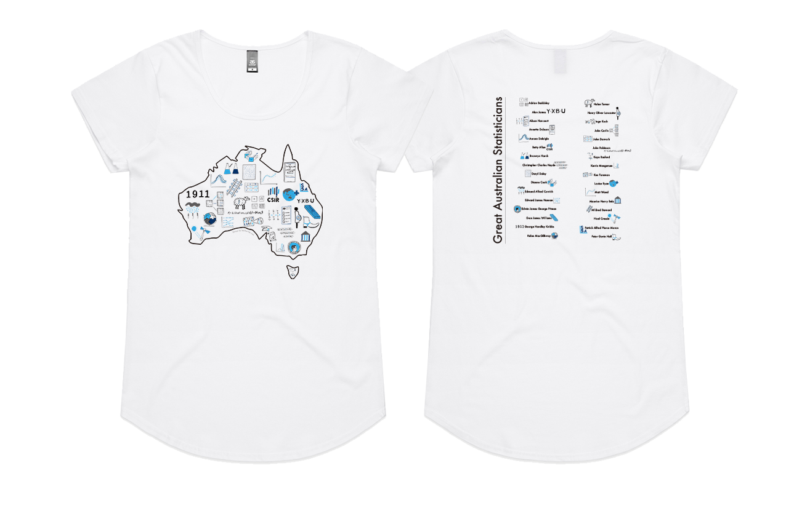
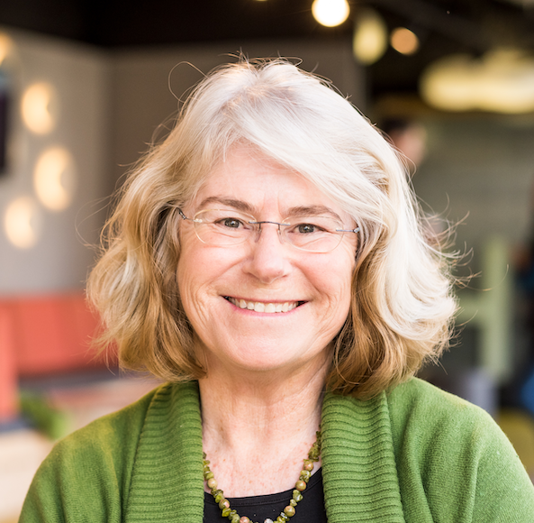
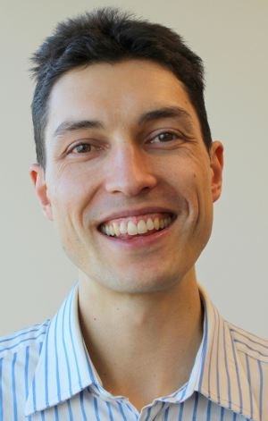
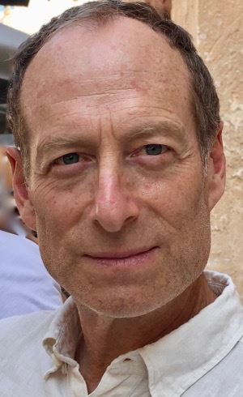

layout: true

```{r, include = FALSE}
current_file <- knitr::current_input()
basename <- gsub(".Rmd$", "", current_file)

knitr::opts_chunk$set(
  fig.path = sprintf("images/%s/", basename),
  fig.width = 6,
  fig.height = 4,
  fig.align = "center",
  fig.retina = 3,
  echo = FALSE,
  warning = FALSE,
  message = FALSE,
  cache = FALSE,
  cache.path = "cache/"
)
```


.footnote[
 These slides are available at https://statsocaus.github.io/vic/intro/`r basename`.html
]

```{r xaringan-themer, include=FALSE, warning=FALSE}
library(xaringanthemer)
style_duo_accent(primary_color = "#003469",
                 secondary_color = "#2babe2",
                 text_font_family = "Glacial Indifference",
                 header_font_family = "Glacial Indifference",
                 text_font_size = "30px"
                )
charcoal <- "#58595b"
```


---


class: inverse middle

# Welcome! 

???


# Acknowledgement of Country

<!-- https://www.statsoc.org.au/Guidelines  -->

Before we begin, we would like to acknowledge the Traditional Custodians of country throughout Australia and their connections to land, sea and community. We pay our respect to their elders past and present and extend that respect to all Aboriginal and Torres Strait Islander peoples today.


---

name: council

# SSA Vic Council 2021

```{r}
person <- function(img, name, position = NULL) {
  position <- ifelse(is.null(position), "", 
                     paste0("**", position, "**"))
  glue::glue(".person.f5[
                    .circle-image-120[
                    ]
                    {position}  
                    {name}]")
}
```

.flex[
`r person("emi.jpeg", "Emi Tanaka", "President")`
`r person("damjan.jpeg", "Damjan Vukcevic", "Vice-President")`
`r person("ben.jpeg", "Ben Harrap", "Secretary")`
`r person("lizzie.jpeg", "Elizabeth Korevaar", "Treasurer")`
`r person("kevin.jpeg", "Kevin Wang", "Communication Officer")`
`r person("rheanna.jpg", "Rheanna Mainzer", "Membership Officer")`
]
<br>
.flex[
`r person("cameron.jpeg", "Cameron Patrick", "ECSS Rep")`
`r person("patrick.jpeg", "Patrick Robotham", "Industry Rep")`
`r person("lidija.jpeg", "Lidija Turkovic", "Deputy Secretary")`
`r person("hien.jpeg", "Hien Nguyen", "Deputy Treasurer")`
`r person("daniel.jpeg", "Daniel Fryer", "Deputy Communication Officer")`
`r person("lauren.jpg", "Lauren Kennedy", "Deputy Membership Officer")`

]

---

name: council

# SSA Vic Council 2022

```{r}
person <- function(img, name, position = NULL, path = "council/") {
  position <- ifelse(is.null(position), "", 
                     paste0("**", position, "**"))
  glue::glue(".person.f5[
                    .circle-image-120[
                    ]
                    {position}  
                    {name}]")
}
```

.flex[
`r person("emi.jpeg", "Emi Tanaka", "President")`
`r person("ben.jpeg", "Ben Harrap", "Vice-President")`
`r person("belinda.jpg", "Belinda Maher")`
`r person("cameron.jpeg", "Cameron Patrick")`
`r person("dennis.png", "Dennis Leung")`
`r person("elena.jpg", "Elena Tartaglia")`


]
<br>
.flex[
`r person("lizzie.jpeg", "Elizabeth Korevaar")`
`r person("joanne.jpg", "Joanne Potts")`
`r person("melissa.jpg", "Melissa Middleton")`
`r person("patrick.jpeg", "Patrick Robotham")`
`r person("rick.jpg", "Rick Tankard")`
`r person("swen.jpg", "Swen Kuh")`


]

---

name: contact

#  Statistical Society of Australia <br> .f2.color-secondary[Victorian Branch]

.fr.center[
The Great Australian <br>Statisticians T-Shirt



.f4[[Designed by Ben Harrap](https://benharrap.com/post/2020-12-02-tshirt-competition/)]

<i class="fas fa-shopping-cart"></i> .f4[Buy at https://www.statsoc.org.au/SSA-T-Shirt]

.f6[Proceeds used to support early career statisticians.]
]

.lh-title[
<br>
<i class="fa fa-link color-secondary"></i>  [www.statsoc.org.au/Victoria](https://www.statsoc.org.au/Victoria)
<br>
<i class="fa fa-envelope color-secondary"></i> [vic.branch@statsoc.org.au](mailto:vic.branch@statsoc.org.au) <br><i class="fa fa-envelope color-primary"></i> [eo@statsoc.org.au](mailto:eo@statsoc.org.au)  

<br><Br>
<i class="fab fa-twitter color-secondary animated bounce"></i> [@SSAVictoria](https://twitter.com/SsaVictoria) &nbsp;&nbsp;&nbsp; <i class="fab fa-twitter color-primary"></i> [@StatSocAus](https://twitter.com/StatSocAus)  
  <br>
<i class="fab fa-meetup color-secondary"></i> [bit.ly/ssavic-meetup](http://bit.ly/ssavic-meetup)  
]

???

* You can find how to get in touch here, 
* in particular, if you want to get in touch with the Victorian Branch, please get in touch using the victorian email address
* I also want to remind you that the Society now has a T-shirt, and you can buy this in the link give here with the proceeds going to support early career statisticians


---

# Di Cook Award

brought to you by the _SSA Victorian Branch_



<br>

.w-85[
* This is an **open-source statistical software award** for the students in Victoria and Tasmania.
* There were a total of **11 applications** in 2021. 
* The next call for submission will open in the last quarter of 2022.

]


<br>

.flex[
.w-20[

]
.w-60.bg-color-primary.pa3[
https://statsocaus.github.io/dicook-award/
]
]

--

<br>

.right[
As for the winner of last year's round...

]


---

# Announcing the Venables Award

brought to you by the _SSA Statistical Computing and Visualisation Section_  

<br>

.flex[
`r person("/dicook-2019.png", "Di Cook", path = "")` 
`r person("/nick-tierney.jpeg", "Nick Tierney", path = "")`
`r person("/petra-kuhnert.jpg", "Petra Kuhnert", path = "")`
`r person("/dean-marchiori.png", "Dean Marchiori", path = "")`
`r person("/person.png", "Thasmika Gokal")`
`r person("/emily-wong.png", "Emily Wong", path = "")`
]

* For new developers of open source software for data analytics.
* First prize is $4000 and runner-up prize is $1000.
* Submissions close on **Fri May 14th 2022**.


.flex.mt3[
.w-20[

]
.w-60.bg-color-primary.pa3[
https://statsocaus.github.io/venables-award/
]
]


---

class: inverse middle


.w-80[
#  Elections... Trust?... Verify!

]

.fr.pr3[
.circle-image-200[
]
.circle-image-200[
]
]
<br>

Dr **Damjan Vukcevic **  
University of Melbourne  
<br>

D/Prof **Philip B. Stark**  
University of California, Berkeley


<br>

Thanks to **Emi Tanaka** (Event Coordinator)

???

Damjan Vukcevic is a Senior Lecturer in Statistical Genomics at the University of Melbourne. He has contributed extensively to human genomics research, beginning with his DPhil studies at the University of Oxford and continuing to his current role as a group leader at Melbourne Integrative Genomics. Damjan has worked both in academia and industry. His recent projects span many fields beyond genomics, including ecology, respiratory medicine, astrophysics and, most recently, election integrity. He has provided expert advice to the insurance sector and policy submissions to Federal Parliament. Damjan is a long-standing contributor to the statistics community in Australia and the SSA in particular, about to conclude his 4-year term as President/Vice-President of SSA Vic.

Philip B. Stark is a Distinguished Professor of Statistics at the University of California, Berkeley. He is the originator of risk-limiting audits, a rigorous method that ensures that tabulation errors did not change the reported election outcome—or (with pre-specified probability) corrects the outcome if it is incorrect. Prof. Stark serves on the Board of Advisors of the U.S. Election Assistance Commission and has consulted for the Secretaries of State of California, Colorado, and New Hampshire. He has testified to state legislatures and as an expert witness in state and federal cases involving election integrity. His research also traverses many other fields, including applications to astrophysics, cosmology, ecology, health, nutrition, business and commerce.