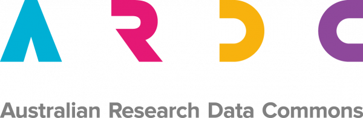
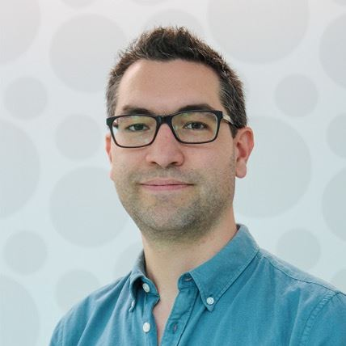
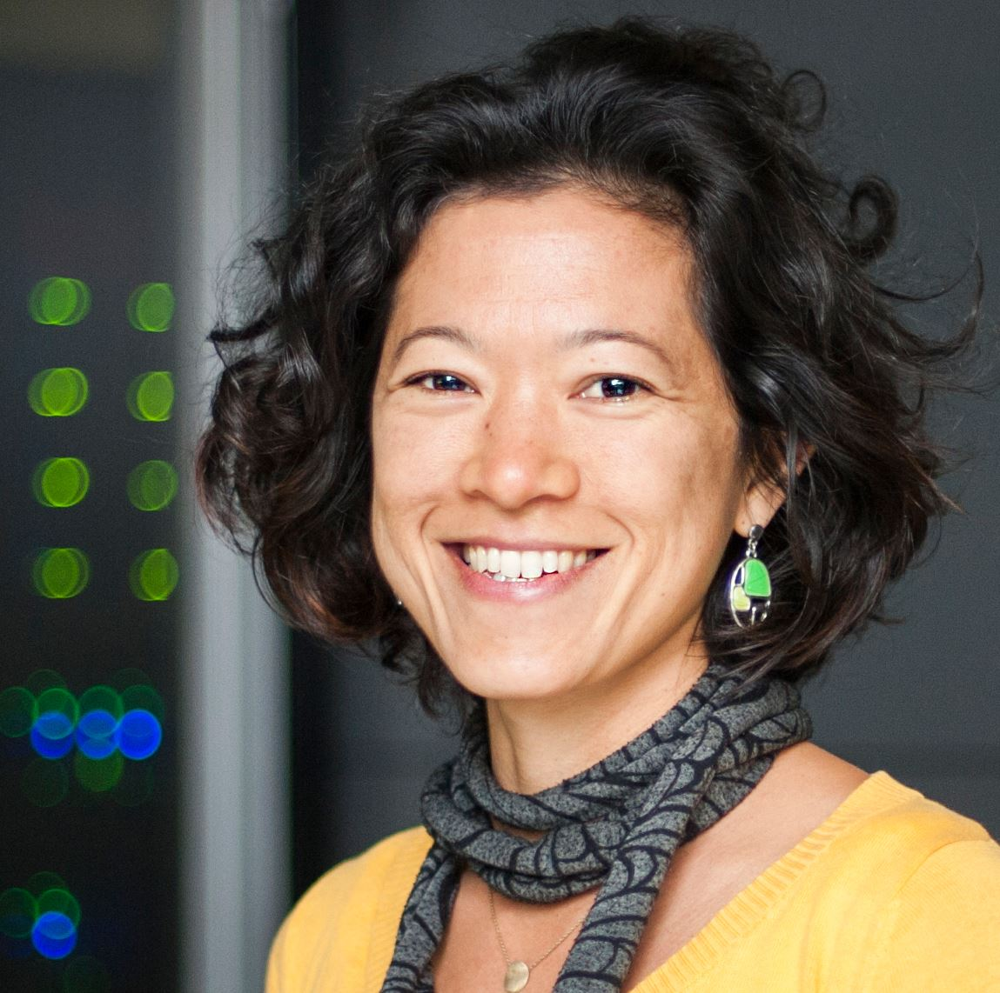
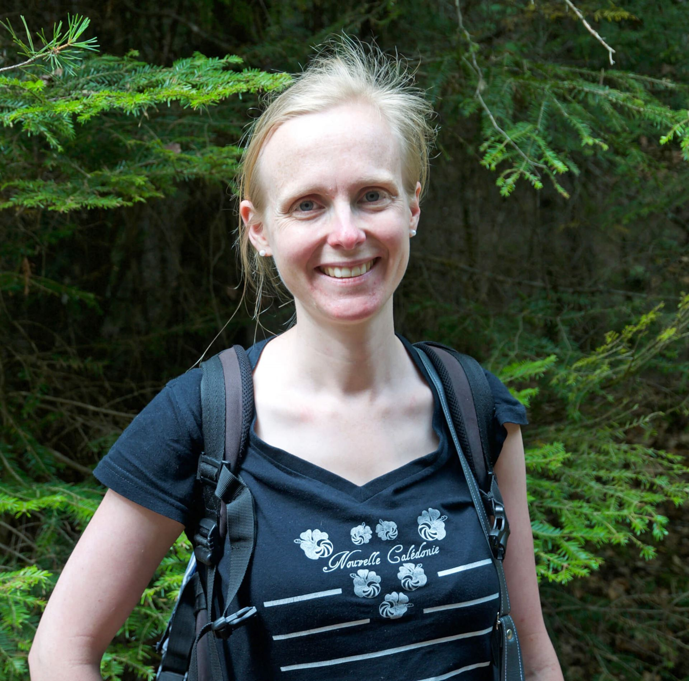
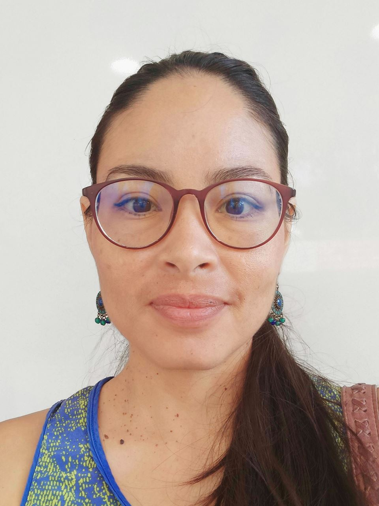

layout: true

```{r, include = FALSE}
current_file <- knitr::current_input()
basename <- gsub(".Rmd$", "", current_file)

knitr::opts_chunk$set(
  fig.path = sprintf("images/%s/", basename),
  fig.width = 6,
  fig.height = 4,
  fig.align = "center",
  fig.retina = 3,
  echo = FALSE,
  warning = FALSE,
  message = FALSE,
  cache = FALSE,
  cache.path = "cache/"
)
```


.footnote[
 These slides are available at https://statsocaus.github.io/vic/intro/`r basename`.html
]

```{r xaringan-themer, include=FALSE, warning=FALSE}
library(xaringanthemer)
style_duo_accent(primary_color = "#003469",
                 secondary_color = "#2babe2",
                 text_font_family = "Glacial Indifference",
                 header_font_family = "Glacial Indifference",
                 text_font_size = "30px"
                )
charcoal <- "#58595b"
```


---


class: inverse middle

# Welcome! 

---

# Acknowledgement of Country

<!-- https://www.statsoc.org.au/Guidelines  -->

<br><br>

.w-70[
We acknowledge that we are on the lands of the Wurundjeri people who have been custodians of this land for thousands of years, and acknowledge and pay our respects to their Elders past and present.

]


---

name: council

# SSA Councils

.flex.f5[
.w-50[


**Victorian Branch**

<i class="fa fa-link color-secondary"></i>  [www.statsoc.org.au/Victoria](https://www.statsoc.org.au/Victoria)
<br>
<i class="fa fa-envelope color-secondary"></i> [vic.branch@statsoc.org.au](mailto:vic.branch@statsoc.org.au)
<i class="fab fa-twitter color-secondary animated bounce"></i> [@SSAVictoria](https://twitter.com/SsaVictoria)  
<i class="fab fa-meetup color-secondary"></i> [bit.ly/ssavic-meetup](http://bit.ly/ssavic-meetup)  

* Emi Tanaka (President)
* Ben Harrap (Vice-President)
* Elena Tartaglia (Secretary)
* Rick Tankard (Treasurer)
* Dennis Leung (Membership Officer)
* Cameron Patrick (Communication Officer)
* Belinda Maher (Deputy Communication Officer)
* Elizabeth Korevaar (Deputy Treasurer)
* Joanne Potts (Deputy Secretary)
* Swen Kuh (Deputy Membership Officer)
* Patrick Robotham (Industry Representative)
* Melissa Middleton (Early Career/Student Statistician). 
 
]
.w-50[

**National** &nbsp;<i class="fab fa-twitter color-primary"></i> [@StatSocAus](https://twitter.com/StatSocAus)   &nbsp; <i class="fa fa-envelope color-primary"></i> [eo@statsoc.org.au](mailto:eo@statsoc.org.au)  

<br>

**Canberra Branch**

<i class="fa fa-link color-secondary"></i>  [www.statsoc.org.au/Canberra](https://www.statsoc.org.au/Canberra)
<br>
<i class="fa fa-envelope color-secondary"></i> [ssacanberra@gmail.com](mailto:ssacanberra@gmail.com)

.fr[
`r person("/emi.jpeg", "Emi Tanaka")` 

`r person("/Pauline OShaughnessy - Treasurer.jpg", "Pauline O'Shaughnessy", path = "council/canberra/")` 

]

* Pauline O'Shaughnessy (President)
* Francis Hui (Vice-President)
* Warren Muller (Secretary)
* Brenda Vo (Treasurer)
* Anton Westveld
* Nick Husek
* Nelson Chua
* Xuan Liang
* Ian McDermid
* Luca Maestrini


]
]


---

# Australian Research Data Commons



<i class="fa fa-link color-secondary"></i> https://ardc.edu.au/

* The ARDC sees software as a research enabler. 
* The ARDC established a national agenda to **recognise research software as a first-class research output** and is achieving this collaboratively by engaging widely with Australia’s research sector.

.fr[
`r person("/paula.jpg", "Paula Andrea Martinez", path = "")` 
]


---

# Venables Award

brought to you by the _SSA Statistical Computing and Visualisation Section_  

<br>

.flex[
`r person("/dicook-2019.png", "Di Cook", path = "")` 
`r person("/nick-tierney.jpeg", "Nick Tierney", path = "")`
`r person("/petra-kuhnert.jpg", "Petra Kuhnert", path = "")`
`r person("/dean-marchiori.png", "Dean Marchiori", path = "")`
`r person("/person.png", "Thasmika Gokal")`
`r person("/emily-wong.png", "Emily Wong", path = "")`
]

* For new developers of open source software for data analytics.
* First prize is $4000 and runner-up prize is $1000.
* Submissions close on **Fri May 14th 2022**.


.flex.mt3[
.w-20[

]
.w-60.bg-color-primary.pa3[
https://statsocaus.github.io/venables-award/
]
]


---

class: inverse middle


.w-80[
#  Research software engineers: how will they shape statistics? 

]


.fr.pr3[
.circle-image-120[
]
.circle-image-120[
]
.circle-image-120[
]
]

.fr.pr3[
.circle-image-120[
]
.circle-image-120[
]
]


Dr **Maëlle Salmon **  .f4[rOpenSci, France]  

**Paula Andrea Martinez **  .f4[Australian Rsearch Data Commons]  

Professor **Thomas Lumley** .f4[University of Auckland, New Zealand]

Professor **Nick Golding** .f4[Telethon Kids Institute & Curtin University]

<br>

Chaired by A/Professor **Kim-Anh Lê Cao** .f4[University of Melbourne]

<br>

Thanks to **Emi Tanaka** and **Francis Hui** (Event Coordinators)

???

Research software engineers: how will they shape statistics?
A growing number of people in academia combine their (perhaps informally trained) programming skills with their research expertise. This led to the establishment of the UK Research Software Engineering Association in 2013, which coined the term “Research Software Engineer” (RSE)  to represent this community. RSEs do not have to have a formal training in software engineering and are often embedded across different disciplines, without perhaps being named as RSEs.

Research software are key pillars that underpin the modern landscape of statistics and data analysis, yet those who develop these tools often lack formal recognition or reward in the academic system. Does the academic system need to be modified to retain these talents? If so, how should the research and education system be modified to accommodate the growth of RSEs? How will RSEs contribute to shaping the field of statistics?
 
 We are pleased to have a diverse panel of experts to discuss about the RSEs and their possible impact on the field of statistics. This event will be discussion-driven with no talks, so do bring any questions you were curious about!

Maëlle Salmon (R OpenSci)
Paula Andrea (Australian Research Data Commons).
Thomas Lumley (University of Auckland)
Nick Golding (Telethon Kids Institute, Curtin University)
Chaired by Kim-Anh Lê Cao (University of Melbourne).


* Maëlle Salmon is a R(esearch) Software Engineer, part-time with rOpenSci where she, among other things, maintains the guide rOpenSci Packages: Development, Maintenance, and Peer Review. She also created the R-hub blog and co-wrote the book HTTP testing in R with Scott Chamberlain. She regularly contracts for various organizations, including research institutions, for developing or strengthening R packages. Maëlle has a PhD in Statistics. She lives in Nancy, France. Maëlle on GitHub, Twitter, Website. 
* Paula Andrea Martinez is the ARDC Software Project Coordinator and ReSA Community Manager. She is leading projects of the Software Program to See, Shape and Sustain research software. She is a co-chair of the international FAIR4RS working group, co-host of the Visible Research Software interest group, and Steering Committee member of the RSE AUNZ association. She has developed strategic planning and work packages to lead change in the recognition of research software as a first-class scholarly output of research. After completing a PhD in applied bioinformatics she transitioned from being a research software engineer to a trainer, then advocate of research best practices, and now working on incentivising policy implementation to recognise authors of research software. 
* Thomas Lumley is a Professor of Biostatistics at the University of Auckland and a member of R Core.  Thomas has been writing statistical and graphics software in a variety of languages for other people to use since high school.  He maintains the 'survey' package for R and wrote software for genome-wide association analysis at the Cardiovascular Health Research Unit in Seattle. 
* Nick Golding currently calls himself an infectious disease modeller and spends his time developing analyses to support control of COVID-19 and malaria. He is a part-time epidemiologist, part-time ecologist, and part time statistician, and tying together this hodge-podge of research fields is Research Software Engineering. Nick is the author of over 20 pieces of research software in R to implement these methods, including the Bayesian modelling R package greta. 

* Associate Professor Kim-Anh Lê Cao develops novel methods, software and tools to interpret big biological data and answer research questions efficiently. She is committed to statistical education to instil best analytical practice.

Kim-Anh has a mathematical engineering background and graduated with a PhD in statistics from the Université de Toulouse, France. She then moved to Australia to forge her own non-linear career path as a multi-disciplinary collaborator, both as a biostatistician consultant at QFAB Bioinformatics, and as a research group leader at the biomedical University of Queensland Diamantina Institute. She currently continues her strong research focus at the University of Melbourne. Kim-Anh has secured two consecutive NHMRC fellowships and received the Australian Academy of Science’s Moran Medal for her contributions to Applied Statistics in 2019. She was selected to the international Homeward Bound leadership program for women in STEMM, culminating to a trip to Antarctica.

 