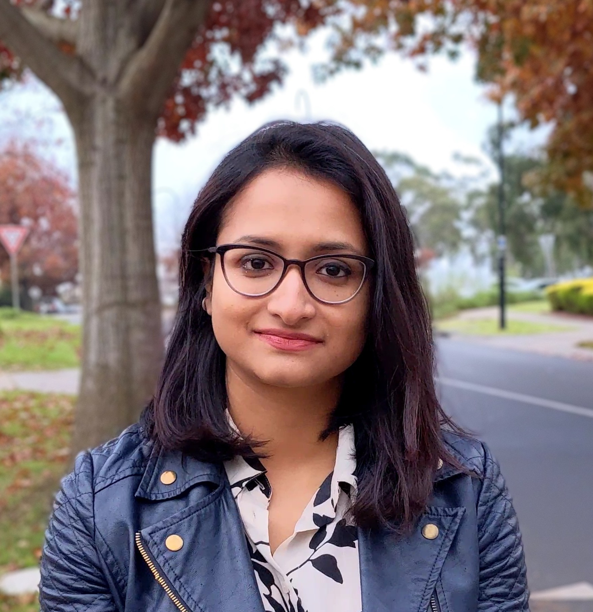

layout: true

```{r, include = FALSE}
current_file <- knitr::current_input()
basename <- gsub(".Rmd$", "", current_file)

knitr::opts_chunk$set(
  fig.path = sprintf("images/%s/", basename),
  fig.width = 6,
  fig.height = 4,
  fig.align = "center",
  fig.retina = 3,
  echo = FALSE,
  warning = FALSE,
  message = FALSE,
  cache = FALSE,
  cache.path = "cache/"
)
```


.footnote[
 These slides are available at https://statsocaus.github.io/vic/intro/`r basename`.html
]

```{r xaringan-themer, include=FALSE, warning=FALSE}
library(xaringanthemer)
style_duo_accent(primary_color = "#003469",
                 secondary_color = "#2babe2",
                 text_font_family = "Glacial Indifference",
                 header_font_family = "Glacial Indifference",
                 text_font_size = "30px"
                )
charcoal <- "#58595b"
```

```{css, echo = FALSE}
.speaker-photo {
  width: 150px;
  border: 3px solid black;
  border-radius: 5px;
}
```


---


class: inverse middle

# Welcome! 

---

# Acknowledgement of Country

<!-- https://www.statsoc.org.au/Guidelines  -->

<br><br>

.w-70[
We acknowledge that we are on the lands of the Wurundjeri people who have been custodians of this land for thousands of years, and acknowledge and pay our respects to their Elders past and present.

]


---

name: council

# SSA Vic Council 2022

```{r}
person <- function(img, name, position = NULL, twitter = NULL, path = "council/") {
  position <- ifelse(is.null(position), "", 
                     paste0("**", position, "**"))
  twitter <- ifelse(is.null(twitter),
                    "",
                    paste0("<i class='fab fa-twitter'></i>", twitter))
  glue::glue(".person.f6[
                    .circle-image-120[
                    ]
                    {position}  
                    {name}  
                    {twitter}]")
}
```

.flex[
.w-20[
`r person("emi.jpeg", "Emi Tanaka", "President", "@statsgen")`
]
.w-20[
`r person("ben.jpeg", "Ben Harrap", "Vice-President", "@BHarrap")`
]
.w-20[
`r person("elena.jpg", "Elena Tartaglia", "Secretary", twitter = "@elena_tartaglia")`
]
.w-20[
`r person("rick.jpg", "Rick Tankard", "Treasurer", twitter = "@RickTankard")`
]
.w-20[
`r person("dennis.png", "Dennis Leung", "Membership Officer")`
]
.w-20[
`r person("cameron.jpeg", "Cameron Patrick", "Comms Officer", twitter = "@camjpatrick")`

]
]
<br>
.flex[
.w-20[
`r person("patrick.jpeg", "Patrick Robotham", "Industry Rep", twitter = "@PatrickRobotham")`
]
.w-20[
`r person("melissa.jpg", "Melissa Middleton", "ECSS Rep", twitter = "@MK_Middleton")`
]
.w-20[
`r person("joanne.jpg", "Joanne Potts", "Deputy Secretary", twitter = "@AnalyticalEdge")`
]
.w-20[
`r person("lizzie.jpeg", "Elizabeth Korevaar", "Deputy Treasurer", twitter = "@lizziekorevaar")`
]
.w-20[
`r person("swen.jpg", "Swen Kuh", "Deputy Membership Officer", twitter = "@swenkuh")`
]
.w-20[
`r person("belinda.jpg", "Belinda Maher", "Deputy Comms Officer", twitter = "@mingabelle")`
]]

---

name: contact

#  Statistical Society of Australia <br> .f2.color-secondary[Victorian Branch]

.fr.center[
The Great Australian <br>Statisticians T-Shirt


.f4[[Designed by Ben Harrap](https://benharrap.com/post/2020-12-02-tshirt-competition/)]

<i class="fas fa-shopping-cart"></i> .f4[Buy at https://www.statsoc.org.au/SSA-T-Shirt]

.f6[Proceeds used to support early career statisticians.]
]

.lh-title[
<br>
<i class="fa fa-link color-secondary"></i>  [www.statsoc.org.au/Victoria](https://www.statsoc.org.au/Victoria)
<br>
<i class="fa fa-envelope color-secondary"></i> [vic.branch@statsoc.org.au](mailto:vic.branch@statsoc.org.au) <br><i class="fa fa-envelope color-primary"></i> [eo@statsoc.org.au](mailto:eo@statsoc.org.au)  

<br><Br>
<i class="fab fa-twitter color-secondary animated bounce"></i> [@SSAVictoria](https://twitter.com/SsaVictoria) &nbsp;&nbsp;&nbsp; <i class="fab fa-twitter color-primary"></i> [@StatSocAus](https://twitter.com/StatSocAus)  
  <br>
<i class="fab fa-meetup color-secondary"></i> [bit.ly/ssavic-meetup](http://bit.ly/ssavic-meetup)  
]

???

* You can find how to get in touch here, 
* in particular, if you want to get in touch with the Victorian Branch, please get in touch using the victorian email address
* I also want to remind you that the Society now has a T-shirt, and you can buy this in the link give here with the proceeds going to support early career statisticians


---

# Di Cook Award

brought to you by the _SSA Victorian Branch_


<br>

.w-85[
* This is an **open-source statistical software award** for the students in Victoria and Tasmania.
* There were a total of **11 applications** in 2021 -- the winner and two honourable mentions are presenting today. 
* The next call for submission will open in the last quarter of 2022.

]


<br>

.flex[
.w-20[

]
.w-60.bg-color-primary.pa3[
https://statsocaus.github.io/dicook-award/
]
]


---

# The Venables Award

brought to you by the _SSA Statistical Computing and Visualisation Section_  

<br>

.flex[
`r person("/dicook-2019.png", "Di Cook", path = "")` 
`r person("/nick-tierney.jpeg", "Nick Tierney", path = "")`
`r person("/petra-kuhnert.jpg", "Petra Kuhnert", path = "")`
`r person("/dean-marchiori.png", "Dean Marchiori", path = "")`
`r person("/person.png", "Thasmika Gokal")`
`r person("/emily-wong.png", "Emily Wong", path = "")`
]

* For new developers of open source software for data analytics.
* First prize is $4000 and runner-up prize is $1000.
* Submissions close on **Fri May 20th 2022**.


.flex.mt3[
.w-20[

]
.w-60.bg-color-primary.pa3[
https://statsocaus.github.io/venables-award/
]
]

---

class: center middle

# <i class="fas fa-utensils"></i> Call for dinner

We'll be heading to a nearby restaurant after the talk.  

Let us know if you want to join!

---

class: inverse middle

.flex[
.w-33.center[


### Sayani Gupta
`gravitas` <i class="fab fa-r-project"></i> <i class="fas fa-box"></i>
]
.w-33.center[

### Jeffrey Pullin
`rater` <i class="fab fa-r-project"></i> <i class="fas fa-box"></i>
]
.w-33.center[

###  Weihao (Patrick) Li 
`spotoroo` <i class="fab fa-r-project"></i> <i class="fas fa-box"></i>
]
]

<br>

Thanks to:

* **Dennis Leung** (Event Coordinator)
* **Cameron Patrick** (Deputy Event Coordinator)

???

## Patrick

Bio: Patrick is a second-year PhD student in the Department of Econometrics and Business Analytics, Monash University. He is currently working on automated visual inference using computer vision model with Prof. Di Cook and Dr. Emi Tanaka. His research interests are machine learning, computer vision, data visualisation and statistical software development.

Abstract: Spotoroo is an open-source R package which offers a spatiotemporal clustering algorithm to organise satellite hotspot data for the purpose of tracking bushfires remotely. This work is motivated by the catastrophic bushfires in Australia throughout the summer of 2019-2020 and made possible with the availability of satellite hotspot data. The algorithm is inspired by two existing spatiotemporal clustering algorithms but makes enhancements to cluster points spatially in conjunction with their movement across consecutive time periods, and allows for the adjustment of key parameters if required, for different locations and satellite data sources.

## Jeffrey

Bio: Jeffrey recently graduated from a Master of Science (Mathematics and Statistics) degree at the University of Melbourne, receiving the Dwight prize as the best performing student in statistics. He is currently working as a research assistant in Davis McCarthy's statistical bioinformatics group at the St Vincent's Institute of Medical research. Before studying his MSc he completed a BSc, also at the University of Melbourne, and worked as a graduate at the Australian Institute of Health and Welfare, in the Australian Public Service.

Abstract: A common task in health and medicine is the classification of patient information into one of several categories by a trained expert. This could include assessing the presence and type of a tumor from a medical image or providing a disease diagnosis from a series of medical tests. Often such judgements are hard to make and error prone: two experts may rate the same scenario differently or the same expert may provide alternative ratings of the same scenario when rating it multiple times.

In this talk, Jeffrey will describe the R package rater, which implements statistical models designed to analyse the so-called repeated categorical rating data. Specifically, rater implements Bayesian versions of several variants of the Dawid-Skene model (Dawid and Skene 1979). Inference is performed using the probabilistic programming language Stan, marginalising out discrete parameters from the models. He will highlight the various data input, data summarisation, diagnostic, plotting and model comparison features implemented in rater. 

In addition, his talk will briefly highlight more recent work, inspired by his experience implementing rater, which seeks to understand the computational impact of marginalizing out discrete parameters in Bayesian computations.

## Sayani

Bio: Sayani is a statistician and recently finished her PhD from the Department of Econometrics and Business Statistics, Monash University.  She is currently working as a Research Fellow with her supervisors Prof. Rob Hyndman and Prof. Dianne Cook. Previously, she has done her Masters and Honors in Statistics back in India, where she also worked as a consultant and senior analyst in firms like KPMG and American Express. Her research interests include visualization, computational statistics, time series, forecasting and data analysis. She enjoys using Statistics to solve real-world problems and almost always uses R to do that. 

Abstract: Several classes of time deconstructions exist, resulting in alternative data segmentation and, as a result, different visualizations that can aid in the identification of underlying patterns. Cyclic time granularities like hour of the day, day of the week, or special holidays can be used to create a visualisation of the data to explore for periodicities, associations, and anomalies. Analysts are expected to comprehensively explore the many ways to view and analyze such graphics, however, the lack of a systematic approach to do so becomes overwhelming due to plethora of choices. The package provides tools to compute possible cyclic granularities from an ordered (usually temporal) index and also a framework to explore the distribution of a univariate variable conditional on one or two cyclic time granularities by defining “harmony”. A “harmony” denotes pairs of granularities that could be effectively analyzed together and reduces the search from all possible options. The search can be narrowed down further for informative granularities by selecting those graphics for which the differences between the displayed distributions are greatest and also rating them in order of importance of capturing maximum variation.