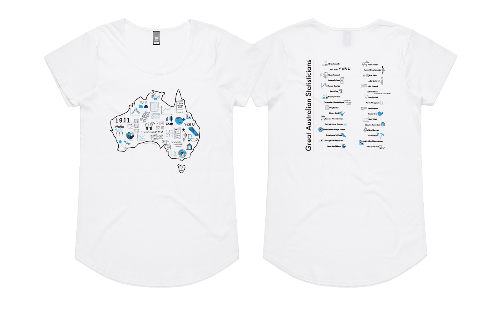

layout: true

```{r, include = FALSE}
current_file <- knitr::current_input()
basename <- gsub(".Rmd$", "", current_file)

knitr::opts_chunk$set(
  fig.path = sprintf("images/%s/", basename),
  fig.width = 6,
  fig.height = 4,
  fig.align = "center",
  fig.retina = 3,
  echo = FALSE,
  warning = FALSE,
  message = FALSE,
  cache = FALSE,
  cache.path = "cache/"
)
```


.footnote[
 These slides are available at https://statsocaus.github.io/vic/intro/`r basename`.html
]

```{r xaringan-themer, include=FALSE, warning=FALSE}
library(xaringanthemer)
style_duo_accent(primary_color = "#003469",
                 secondary_color = "#2babe2",
                 text_font_family = "Glacial Indifference",
                 header_font_family = "Glacial Indifference",
                 text_font_size = "30px"
                )
charcoal <- "#58595b"
```

```{css, echo = FALSE}
.speaker-photo {
  width: 150px;
  border: 3px solid black;
  border-radius: 5px;
}
```


---


class: inverse middle

# Welcome! 

---

# Acknowledgement of Country

<!-- https://www.statsoc.org.au/Guidelines  -->

<br><br>

.w-70[
In the spirit of reconciliation the Statistical Society of Australia acknowledges the Traditional Custodians of country throughout Australia and their connections to land, sea and community. We pay our respect to their elders past and present and extend that respect to all Aboriginal and Torres Strait Islander peoples today.

]


---

name: council

# SSA Vic Council 2022

```{r}
person <- function(img, name, position = NULL, twitter = NULL, path = "council/") {
  position <- ifelse(is.null(position), "", 
                     paste0("**", position, "**"))
  twitter <- ifelse(is.null(twitter),
                    "",
                    paste0("<i class='fab fa-twitter'></i>", twitter))
  glue::glue(".person.f6[
                    .circle-image-120[
                    ]
                    {position}  
                    {name}  
                    {twitter}]")
}
```

.flex[
.w-20[
`r person("emi.jpeg", "Emi Tanaka", "President", "@statsgen")`
]
.w-20[
`r person("ben.jpeg", "Ben Harrap", "Vice-President", "@BHarrap")`
]
.w-20[
`r person("elena.jpg", "Elena Tartaglia", "Secretary", twitter = "@elena_tartaglia")`
]
.w-20[
`r person("rick.jpg", "Rick Tankard", "Treasurer", twitter = "@RickTankard")`
]
.w-20[
`r person("dennis.png", "Dennis Leung", "Membership Officer")`
]
.w-20[
`r person("cameron.jpeg", "Cameron Patrick", "Comms Officer", twitter = "@camjpatrick")`

]
]
<br>
.flex[
.w-20[
`r person("patrick.jpeg", "Patrick Robotham", "Industry Rep", twitter = "@PatrickRobotham")`
]
.w-20[
`r person("melissa.jpg", "Melissa Middleton", "ECSS Rep", twitter = "@MK_Middleton")`
]
.w-20[
`r person("joanne.jpg", "Joanne Potts", "Deputy Secretary", twitter = "@AnalyticalEdge")`
]
.w-20[
`r person("lizzie.jpeg", "Elizabeth Korevaar", "Deputy Treasurer", twitter = "@lizziekorevaar")`
]
.w-20[
`r person("swen.jpg", "Swen Kuh", "Deputy Membership Officer", twitter = "@swenkuh")`
]
.w-20[
`r person("belinda.jpg", "Belinda Maher", "Deputy Comms Officer", twitter = "@mingabelle")`
]]

--

.center.animated.pulse.infinite.slow[
**We are seeking expressions of interest for  joining the council in 2023!**

]

---

name: contact

#  Statistical Society of Australia <br> .f2.color-secondary[Victorian Branch]

.fr.center[
The Great Australian <br>Statisticians T-Shirt



.f4[[Designed by Ben Harrap](https://benharrap.com/post/2020-12-02-tshirt-competition/)]

<i class="fas fa-shopping-cart"></i> .f4[Buy at https://www.statsoc.org.au/SSA-T-Shirt]

.f6[Proceeds used to support early career statisticians.]
]

.lh-title[
<br>
<i class="fa fa-link color-secondary"></i>  [www.statsoc.org.au/Victoria](https://www.statsoc.org.au/Victoria)
<br>
<i class="fa fa-envelope color-secondary"></i> [vic.branch@statsoc.org.au](mailto:vic.branch@statsoc.org.au) <br><i class="fa fa-envelope color-primary"></i> [eo@statsoc.org.au](mailto:eo@statsoc.org.au)  

<br><Br>
<i class="fab fa-twitter color-secondary animated bounce"></i> [@SSAVictoria](https://twitter.com/SsaVictoria) &nbsp;&nbsp;&nbsp; <i class="fab fa-twitter color-primary"></i> [@StatSocAus](https://twitter.com/StatSocAus)  
  <br>
<i class="fab fa-meetup color-secondary"></i> [bit.ly/ssavic-meetup](http://bit.ly/ssavic-meetup)  
]

???

* You can find how to get in touch here, 
* in particular, if you want to get in touch with the Victorian Branch, please get in touch using the victorian email address
* I also want to remind you that the Society now has a T-shirt, and you can buy this in the link give here with the proceeds going to support early career statisticians


---

# Funding and Membership


* **Up to $200 of financial support for SSA Vic members!** <br> <i class="fas fa-link"></i> https://bit.ly/ssavic-funding-2022 <br> E.g. for the SQL Workshop at https://statsoc.org.au/event-4912530

<br>


* **Join SSA Vic!**:
  * SSA membership is $20 only for students 
  * Full membership is $250 or $240 for automatic renewal
  * [Recent graduates are eligible for discounts](https://statsoc.org.au/Forum-general-topics/12893603)!
  * Benefits: https://www.statsoc.org.au/page-1075427


---

# SSA Mentoring Program 2023

.flex[
.w-80[
* The SSA Mentoring Committee is now taking expressions of interest for the 2023 Mentoring Program!
* Open to all members of the Society, the program will connect early and mid-career statisticians with experienced mentors to provide them with career guidance and share their experiences to help them achieve their professional goals.
* To find out if you are eligible or for more information, please visit the SSA Mentoring Program webpage: https://statsoc.org.au/Mentoring
* Register your interest by **Sunday 11th December 2022**

]

.w-20[


]

]


---

# 2022 Di Cook Award


* Our **open-source statistical software award** is open again!
* We are calling for submissions from students (or recent graduates) of Victorian or Tasmanian tertiary institutes
* Submissions deadline extended to **Fri 16th Dec 2022**
* Winner, announced in March 2023, will win $1,000
* Find more information at


.flex[
.w-20[

]
.w-60.bg-color-primary.pa3[
https://statsocaus.github.io/dicook-award/
]
]

---

class: center middle

# <i class="fab fa-slack"></i> SSA Community Slack


.f1[[bit.ly/ssa-slack](https://bit.ly/ssa-slack)]


---

class: inverse middle


# <i class="fas fa-comments"></i> Virtual social event with SSA Vic

<br>

Featuring **Jess Kasza** and **Ian Gordon** 
.circle-image-200.fr[
]
.circle-image-200.fr[
]

<br><br>

.f3[
Thanks to event coordinators: **Melissa Middleton** and **Elizabeth Korevaar** 

]


???

