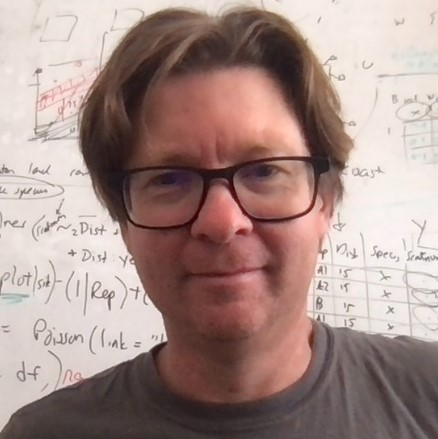

layout: true

```{r, include = FALSE}
current_file <- knitr::current_input()
basename <- gsub(".Rmd$", "", current_file)

knitr::opts_chunk$set(
  fig.path = sprintf("images/%s/", basename),
  fig.width = 6,
  fig.height = 4,
  fig.align = "center",
  fig.retina = 3,
  echo = FALSE,
  warning = FALSE,
  message = FALSE,
  cache = FALSE,
  cache.path = "cache/"
)

```


.footnote[
 These slides are available at https://statsocaus.github.io/vic/intro/`r basename`.html
]

```{r xaringan-themer, include=FALSE, warning=FALSE}
library(xaringanthemer)
style_duo_accent(primary_color = "#003469",
                 secondary_color = "#2babe2",
                 text_font_family = "Glacial Indifference",
                 header_font_family = "Glacial Indifference",
                 text_font_size = "30px"
                )
charcoal <- "#58595b"
```

```{css, echo = FALSE}
.speaker-photo {
  width: 150px;
  border: 3px solid black;
  border-radius: 5px;
}
```


---


class: inverse middle

# Welcome! 

---

# Acknowledgement of Country

<!-- https://www.statsoc.org.au/Guidelines  -->

<!-- muwinina people (pronounced mou wee nee nar) -->

<!-- The University of Melbourne acknowledges the Traditional Owners of the unceded land on which we work, learn and live: the Wurundjeri Woi-wurrung and Bunurong peoples (Burnley, Fishermans Bend, Parkville, Southbank and Werribee campuses), the Yorta Yorta Nation (Dookie and Shepparton campuses), and the Dja Dja Wurrung people (Creswick campus). -->

<!-- The University also acknowledges and is grateful to the Traditional Owners, Elders and Knowledge Holders of all Indigenous nations and clans who have been instrumental in our reconciliation journey. -->

<!-- We recognise the unique place held by Aboriginal and Torres Strait Islander peoples as the original owners and custodians of the lands and waterways across the Australian continent, with histories of continuous connection dating back more than 60,000 years. We also acknowledge their enduring cultural practices of caring for Country. -->

<!-- We pay respect to Elders past, present and future, and acknowledge the importance of Indigenous knowledge in the Academy. As a community of researchers, teachers, professional staff and students we are privileged to work and learn every day with Indigenous colleagues and partners. -->

<!-- In making this Acknowledgment of Country we commit to respectful and responsible conduct towards all others according to the Traditional lores of this land, particularly at times of formal ceremony. -->
<!-- <br><br> -->

.w-70[
We pay respect to the traditional and original owners of this land, the Wurundjeri Woi-wurrung and Bunurong peoples, to pay respect to those that have passed before us.

<br>

We extend our respect also to the traditional owners of the lands from which people in our livestream are joining.

]


```{r}
person <- function(img, name, position = NULL, twitter = NULL, path = "council/") {
  position <- ifelse(is.null(position), "", 
                     paste0("**", position, "**"))
  twitter <- ifelse(is.null(twitter),
                    "",
                    paste0("<i class='fab fa-twitter'></i>", twitter))
  glue::glue(".person.f6[
                    .circle-image-120[
                    ]
                    {position}  
                    {name}  
                    {twitter}]")
}
```

---

name: council

# 👋 SSA Vic & Tas Council 2024


.flex[
.w-20[
`r person("alun.jpg", "Alun Pope", "President")`
]
.w-20[
`r person("inge.jpg", "Inge Koch", "Vice-President")`
]
.w-20[
`r person("elena.jpg", "Elena Tartaglia", "Secretary", twitter = "@elena_tartaglia")`
]
.w-20[
`r person("rick.jpg", "Rick Tankard", "Treasurer", twitter = "@RickTankard")`
]
.w-20[
`r person("dennis.png", "Dennis Leung", "Membership Officer")`
]
.w-20[
`r person("stelios.jpg", "Stelios Georgiou", "Communications Officer")`
]

]

.flex[
.w-20[
`r person("chris.png", "Chris Selman", "ECSS Rep")`
]
.w-20[
`r person("patrick.jpeg", "Patrick Robotham", "Industry Rep", twitter = "@PatrickRobotham")`
]
.w-20[
`r person("paul.JPG", "Paul Burch", "Tasmanian Rep")`
]
.w-20[
`r person("anna.jpg", "Anna Wilkinson", "Deputy Treasurer", twitter = "@AnnaLWil")`
]
.w-20[
`r person("swen.jpg", "Swen Kuh", "Membership Officer", twitter = "@swenkuh")`
]
.w-20[
`r person("alex-ek.jpg", "Alexander Ek", "Deputy Communications Officer")`
]

]

<!-- .center[ -->
<!-- **Tonight's event organisers are Paul and Elena** -->


---

name: contact

#  Statistical Society of Australia <br> .f2.color-secondary[Victorian & Tasmanian Branch]

.fr.center[
The Great Australian <br>Statisticians T-Shirt


.f4[[Designed by Ben Harrap](https://benharrap.com/post/2020-12-02-tshirt-competition/)]

<i class="fas fa-shopping-cart"></i> .f4[Buy at https://www.statsoc.org.au/SSA-T-Shirt]

.f6[Proceeds used to support early career statisticians.]
]

.lh-title[
<br>
<i class="fa fa-link color-secondary"></i>  [www.statsoc.org.au/Victoria](https://www.statsoc.org.au/Victoria)
<br>
<i class="fa fa-envelope color-secondary"></i> [vic.branch@statsoc.org.au](mailto:vic.branch@statsoc.org.au) <br><i class="fa fa-envelope color-primary"></i> [eo@statsoc.org.au](mailto:eo@statsoc.org.au)  

<br><Br>
<i class="fab fa-linkedin color-secondary animated bounce"></i> [SSA Victoria and Tasmania](https://www.linkedin.com/company/ssa-victoria-and-tasmania/)  
  <br>
<i class="fab fa-meetup color-secondary"></i> [bit.ly/ssavic-meetup](http://bit.ly/ssavic-meetup)  
]

???

* You can find how to get in touch here, 
* in particular, if you want to get in touch with the Victorian Branch, please get in touch using the Victorian email address
* I also want to remind you that the Society now has a T-shirt, and you can buy this in the link given here with the proceeds going to support early career statisticians

---


# Membership


* **Join SSA Vic & Tas!**
  * SSA membership is only $20 for students 
  * Full membership is $265 annually 
  * [Recent graduates, ABS employees, and retired members are eligible for discounts](https://statsoc.org.au/Forum-general-topics/12893603)!
  * Benefits: https://www.statsoc.org.au/page-1075427
  

---

<!-- # Upcoming events -->


<!-- - <i class="fas fa-calendar"></i> **Wednesday 16 October** <br> *Industry Showcase - panel discussion* <br> -->
<!-- Melbourne in person only (no Hobart hub or online). <br><br> -->

<!-- - <i class="fas fa-calendar"></i> **Thursday 7 November** <br> *Belz Lecture: "Challenges of High Dimension Low Sample Size Data Analysis" presented by Professor Steve Marron* <br> -->
<!-- Both in-person and online, **University of Melbourne** and hub at CSIRO Hobart. <br><br> -->


<!-- --- -->

<!-- class: center middle -->

<!-- # <i class="fas fa-utensils"></i> Call for dinner -->

<!-- We'll be heading to Jack Greene after the talk. -->

<!-- Let us know if you want to join! -->

<!-- --- -->

<!-- class: inverse middle -->

## Challenges of High Dimension Low Sample Size Data Analysis

<!-- .circle-image-200.fl[ -->
<!-- ] -->

###**Professor J. S. Marron, University of North Carolina**

*Steve is a statistician / data scientist who invents methodology for gaining insights from integrated and complex data sources, with an emphasis on managing uncertainty. His current major collaborations include research with genomicists working on complex high dimensional data collected to study cancer, with computer scientists focussed on the statistics of shape in image analysis applications, and with physicians taking a data centric approach to the notoriously hard to treat disease of arthritis.*
<!-- Such collaborations have led him to become a pioneer in developing strong connections between statistics and non-standard areas of mathematics, including geometry (fundamental to shape analysis) and topological data analysis. -->
<!-- Steve is Amos Hawley Distinguished Professor of Statistics and Operations Research at the University of North Carolina.  -->
<!-- His book Object Oriented Data Analysis with Ian Dryden appeared in 2021 -->
<br><br>


