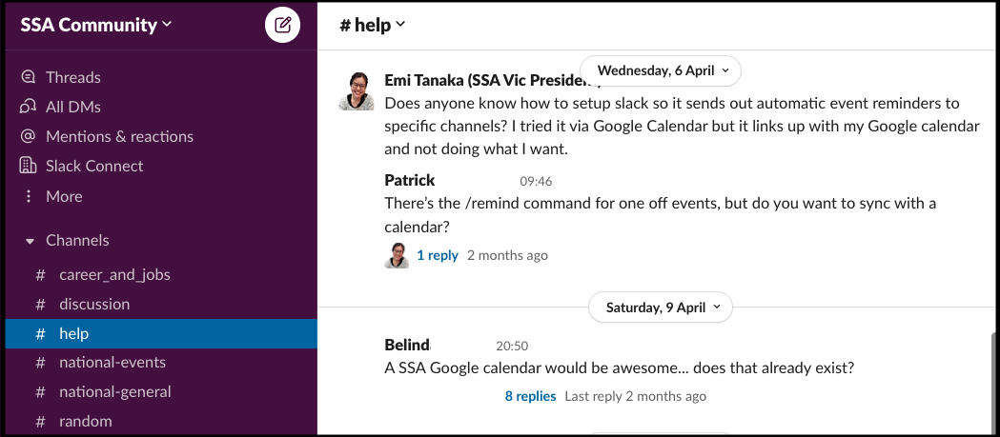
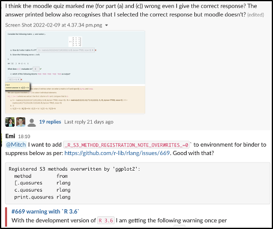

Please note that by joining the SSA Community, you are agree to abide by the

[<button class="button-coc" role="button">SSA Community Slack Code of Conduct</button>](/vic/slack-coc.html)

you can join the SSA Community Slack by clicking on the link below:

[<button class="button-join" role="button"><i class="fab fa-slack"></i> Join SSA Community Slack</button>](https://join.slack.com/t/ssa-community/shared_invite/zt-17uw5mjh3-d0qVJEnwrE9K6MSS26_idA)

**Check out the [Greetings](#Greetings){style="color:#1899D6"} to see what'll you'll be greeted as when you join.**

## About

In today’s world where virtual interactions are increasingly becoming more common (and sometimes a sudden necessity), we want to give a platform where the community can casually engage and have opportunities to network organically. We leverage Slack as **a communication tool to collegially engage the Australian community interested in statistics or data science**.

## Background

###  What is Slack?

Slack is a communication platform that offers different chat rooms (called channels) with messages that can be stylised using markdown or text editor, in addition to an ability to add or react with emojis. An example snapshot is shown below.

The platform tends to promote casual messages, threads for discussion, and it is easy to embed images, tag people, link preview, and add code like below.

### Why Slack?

Slack is used by various companies, organisations and even groups. In addition, the Australian (and New Zealand) statistics community have had several exposure to the usage of Slack now used in Australia and New Zealand Statistics Conference (ANZSC) 2021, Statistical Consulting Network (SCN) 2020, and Early Career & Student Statistics Conference (ECSSC) 2021. The active usage in recent conferences suggest that its usage is effective for at least conference purposes. 

### But we have the ANZstat forum?

The [ANZStat forum](https://www.statsoc.org.au/https/statsoc.org.au/discussion-forum), which evolved out of the ANZStat mailing list, is another platform for discussion, advertising or job posting for the statistical community. 

### But I don’t want to use platforms like Slack

The platform is entirely opt-in and event advertisement is still expected to occur in other channels as well. 

## Greetings

Welcome to the SSA Community!

This workspace is used for you to engage with the Australian community that have an interest in statistics or data science (broadly defined). By default, you'll join the

- **#welcome** channel, where you can introduce yourself to everyone,
- **#random** channel, where you'll see random chatters, which may or may not include some gardening posts from one of the SSA Vic councillors -- if you use twitter, any tweets that have the hashtag #SSACommunity will automatically get posted in this channel, 
- **#help** channel, where you can ask for general help or assistance needed, e.g. navigating Slack, 
* **#career_and_jobs**, where events related to career development or jobs may be posted, 
* **#discussion**, where you can start or engage discussions,
* **#national-events**, where national events may be posted, 
* **#national-general**, where a general conversation can start, and tweets from [@StatSocAus](https://twitter.com/StatSocAus) will be posted,
* **#vic-general**, where a general conversation relevant for Victorian and Tasmanian community can start, and tweets from [@SSAVictoria](https://twitter.com/SsaVictoria) will be posted,
* **#vic-events**, where Victorian or Tasmanian events may be posted, 
* **#vic-help**, where Victorian or Tasmanian community can ask for help.

### What you can do

#### Update your profile

It's paramount importance that you have your full name in your profile with your affiliation and upload a photo of yourself. It's hard to get a sense that you are interacting with real people otherwise. If there's some situation where this is difficult, please flag one of the SSA Vic councillors (listed in the #help channel), otherwise we may prune your account in the future.  

#### Introduce yourself

Do introduce yourself in the #welcome channel so that others can greet you!

#### Join channels

You can join more channels that are of your interest, e.g. for the Victorian and Tasmanian community, we recommend joining the #vic-events, #vic-general, #vic-help. If you are looking for jobs or want to recruit, you can join #jobs, or want to start a discussion, go to #discussion -- there are handy links in the channel that links to the official SSA links.

If you have some special interest topics, you can create your own public channels! We recommend creating channels with the name starting with `topic-` so it's easy for others to navigate. If you some special project or team that you want to put together, we recommend using the prefix `proj-` and `team-`. We do suggest though that you check out what channels exists first before making your own. We may archive channels that become inactive time to time.

#### Change your notification settings

You can change settings for your email notifications or channel specific notifications as you want!

For channel specific notifications, click on the icon <i class="fas fa-angle-down"></i> next to the channel name and you can turn off notification or mute the channel.

For email preferences, click on the icon <i class="fas fa-angle-down"></i> next to the workspace name "SSA Community", go to Preferences then Notifications and chaneg as you see fit.

#### Code of conduct

Please note that by joining this Slack workspace, you agree to respect the [SSA Community Slack code of conduct](/vic/slack-coc.html) -- any violations may see you removed from the workspace. This just means that we expect you to be respectful of others and if there are any incidences that needs to be reported, please contact one of the response team members. 

We are committed to keeping this workspace an inclusive and welcoming place for the community with interest in statistics and data science and if there are ways that we can improve your experience, please do let us know!